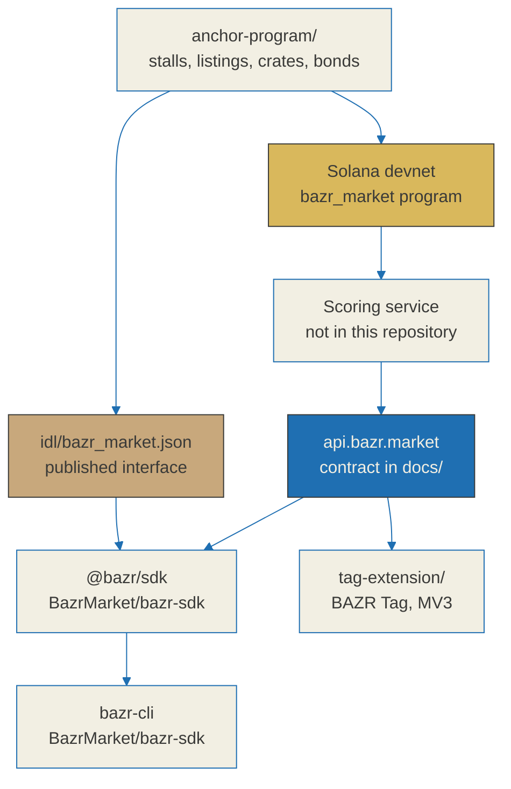

<h1 align="center">BAZR</h1>

<p align="center"><strong>One degen's exit is another's entry.</strong></p>

<p align="center">
  <a href="https://github.com/BazrMarket/bazr/actions/workflows/ci.yml"></a>
  <a href="https://bazr.market"></a>
  <a href="https://api.bazr.market/health"></a>
  <a href="https://github.com/BazrMarket/bazr/blob/main/LICENSE"></a>
  <a href="https://github.com/BazrMarket/bazr/commits/main"></a>
  <a href="https://www.anchor-lang.com/"></a>
  <a href="https://explorer.solana.com/address/FSLSR2xYiR5NPWg6g8DZ1KyVRVa7xW37gDStbaDfSXLb?cluster=devnet"></a>
  <a href="https://www.rust-lang.org/"></a>
</p>

<p align="center">
  <a href="https://developer.chrome.com/docs/extensions/develop"></a>
  <a href="https://github.com/BazrMarket/bazr/blob/main/docs/relic-spec.md"></a>
  <a href="https://github.com/BazrMarket/bazr-sdk"></a>
  <a href="https://github.com/BazrMarket/bazr#nothing-here-is-on-a-package-registry"></a>
  <a href="https://x.com/bazrmarket"></a>
</p>

---

BAZR is an aftermarket for Solana meme tokens that already graduated from a
launchpad. The launchpads compete over the first ten minutes of a token's life.
BAZR only looks at what happens after that, and puts a number on how much of the
token is still standing.

This repository holds the open parts: the on-chain program, the browser
extension, the published IDL, and the full specification of how the score is
computed. The typed SDK and the terminal client live next door in
[BazrMarket/bazr-sdk](https://github.com/BazrMarket/bazr-sdk).

## A relic score is a summary of survival signals

**It is not a prediction of revival, recovery, or price.** Read that before
anything else in this repository, because every design decision below follows
from it.

The score answers one question: *how much of this token's structure is still
intact?* Liquidity that can still be exited, holders that are not one wallet, a
creator wallet that is not sitting on the supply, trades that still happen at
all. Those are observations about the present, and observations about the
present are not forecasts about the future.

Three consequences, all of them enforced in the spec rather than left to good
intentions:

- **The verdict has an "I do not know" state.** A token is scored `dormant`,
  `dead`, or `unclear`. When the signals genuinely conflict, or when too little
  could be observed, the answer is `unclear`. Manufacturing confidence that is
  not there is the fastest way to make this number worthless.
- **Missing data is not bad data.** An axis that could not be read is dropped
  from the weighting and the remaining weights are re-normalised. It is never
  folded in as a zero. Folding it to zero would mean every token whose lookup
  failed renders as dead, which turns the score into a measurement of our own
  uptime rather than of the token.
- **The formula is public.** Every weight, every threshold, and every clamp is
  in [`docs/relic-spec.md`](docs/relic-spec.md). You can recompute a score by
  hand and check ours against it.

Do not use a relic score as a reason to buy or sell anything. The known ways it
can be wrong are written down in [`docs/security.md`](docs/security.md), and we
would rather you read those than trust the number.

## The five axes and their weights

Every relic score is a weighted mean over five axes. The weights are fixed,
published, and shipped on the wire with every response, so no client has to
keep a second copy that can drift:

| Axis | Weight | What it observes |
| --- | --- | --- |
| `lp_residual` | **0.30** | Quote-side liquidity that is still there, and whether the LP is burned or locked |
| `floor_shape` | **0.25** | Whether trading still happens at all, and how recently |
| `holder_dispersion` | **0.20** | How concentrated the remaining supply is, excluding pool, exchange, burn and insider wallets |
| `dev_wallet_state` | **0.15** | Mint and freeze authority, and how much the creator still holds |
| `social_afterglow` | **0.10** | Breadth of distinct participants and new holder inflow |
| | **1.00** | |

The ordering is not arbitrary. `lp_residual` carries the most weight because if
there is no exit liquidity, nothing else about the token matters much.
`social_afterglow` carries the least because it is the easiest signal to
manufacture, and a weight of 0.10 caps how far a manipulated signal can move the
result.

Weights are given before re-normalisation. The derivation of each axis,
including every clamp and interpolation, is in
[`docs/relic-spec.md`](docs/relic-spec.md) section 7.

## Aggregation and verdicts

```text
available = { axis : axis.status == "ok" }
W_avail   = sum(weight of available)

relic     = sum(weight * score for available) / W_avail        # 0..100
```

An axis with `status: "unknown"` leaves the numerator *and* the denominator. It
is not counted as zero. Every response also carries the coverage figure, so a
caller can see how much of the picture was actually observed.

Here is that rule on live data. Wrapped SOL, from the deployed service:

```bash
curl -s https://api.bazr.market/relic/So11111111111111111111111111111111111111112
```

```text
score    71          verdict  dormant

lp_residual         60    weight 0.30   ok
dev_wallet_state   100    weight 0.15   ok
social_afterglow    60    weight 0.10   ok
holder_dispersion   --    weight 0.20   unknown
floor_shape         --    weight 0.25   unknown

(0.30*60 + 0.15*100 + 0.10*60) / 0.55 = 70.9  ->  71
```

Two of the five axes could not be observed, so 45 percent of the weight is
missing. The score is the weighted mean of the three that could be observed,
re-normalised over the 0.55 that remained. Folding the two unobserved axes in as
zeros would have produced 39, and a token that was never measured would be
indistinguishable from a token measured and found dead.

The verdict is then decided in order, first rule to match wins:

| Condition | Verdict |
| --- | --- |
| `lp_residual` unknown, or `W_avail < 0.50` | `unclear` (not enough was observed) |
| `lp_residual <= 10` and `floor_shape` unknown or `<= 10` | `dead` |
| `relic <= 33` | `dead` |
| `relic >= 60` and `lp_residual >= 40` | `dormant` |
| `relic >= 60` but `lp_residual < 40` | `unclear` (high total, but no way out) |
| `34 <= relic <= 59` | `unclear` |

The last two rows are the ones worth arguing about, so here is the reasoning.
The 34-59 band is where the survival signals genuinely disagree with each other;
forcing a `dead` or a `dormant` out of it would be inventing a conclusion. And a
high aggregate with thin liquidity is not `dormant`, because dormant is supposed
to mean *tradeable again* -- when the aggregate and the deciding axis disagree,
the deciding axis wins.

## Architecture



The scoring service and the web frontend are deliberately not open source. What
is here is everything needed to verify the score and to build against it: the
formula, the wire contract, the on-chain program that records stall reputation,
its IDL, and a client that renders the result.

See [`docs/architecture.md`](docs/architecture.md) for the layer-by-layer
breakdown and [`DEPENDENCIES.md`](DEPENDENCIES.md) for an accounting of what is
ours and what is someone else's.

## What is in this repository

```text
anchor-program/    Anchor program bazr_market -- market, stalls, listings, crates
idl/               bazr_market.json, the published program interface
tag-extension/     BAZR Tag -- MV3 extension that overlays scores on addresses
docs/              relic-spec, stall-spec, tag-spec, api-contract,
                   research, architecture, security
```

| Component | State |
| --- | --- |
| `anchor-program/` | Eleven instructions, four account types, `Cargo.lock` committed. Deployed to **devnet only** |
| `idl/` | Produced by `anchor build` from the source in this tree. Matches the deployed program and the IDL account published on devnet -- see below |
| `tag-extension/` | Builds, tests, and an honesty gate. **Not on the Chrome Web Store** |
| `docs/` | Complete for the score formula, stall rules, tag rules, API contract, and the research behind the axes |
| `@bazr/sdk`, `bazr-cli` | In [BazrMarket/bazr-sdk](https://github.com/BazrMarket/bazr-sdk). Build from source; see below |

### Nothing here is on a package registry

**`@bazr/sdk` is not on npm. `bazr-cli` is not on npm. BAZR Tag is not on the
Chrome Web Store.** `npm view bazr-cli` answers `E404`, and there is no store
listing to link to, so this README deliberately carries no global-install line
for either of them. Every install path in this repository and in
[BazrMarket/bazr-sdk](https://github.com/BazrMarket/bazr-sdk) builds from source,
and that is not a workaround shown for completeness -- it is the only path that
exists.

## The on-chain program

The `bazr_market` program is deployed to **Solana devnet only. It is not on
mainnet.** No mainnet transaction has ever been sent, and no user funds are at
risk from it.

| Field | Value |
| --- | --- |
| Program ID | `FSLSR2xYiR5NPWg6g8DZ1KyVRVa7xW37gDStbaDfSXLb` |
| Cluster | `devnet` |
| Loader | BPF Upgradeable, `executable = true` |
| Anchor | 0.31.1 |
| Explorer | [explorer.solana.com/address/FSLSR2xYiR5NPWg6g8DZ1KyVRVa7xW37gDStbaDfSXLb?cluster=devnet](https://explorer.solana.com/address/FSLSR2xYiR5NPWg6g8DZ1KyVRVa7xW37gDStbaDfSXLb?cluster=devnet) |

Anyone can check that for themselves without trusting this table:

```bash
solana account FSLSR2xYiR5NPWg6g8DZ1KyVRVa7xW37gDStbaDfSXLb --url devnet
```

The scoring pipeline and the program are on different clusters on purpose, and
the API reports both separately rather than collapsing them into one `cluster`
field: `data_cluster` is `mainnet` because token data is read from mainnet, and
`program_cluster` is `devnet` because that is where the program lives.
Collapsing those two would let "reads mainnet" be presented as "deployed on
mainnet", which is exactly the claim this project refuses to make.

### A stall's losses are stored the same way as its wins

This is a layout decision, not a UI preference, which is why it appears in the
README of the program repository and not in a style guide.

`Stall` holds `resolved_wins` and `resolved_losses` as the same type, and
`reputation` is signed, so a curator who is wrong more often than right goes
below zero. A listing is never deleted -- withdrawing marks it `Withdrawn`. A
stall account is never deallocated, so a losing record cannot be reset by
closing and reopening at the same address. Resolution is an authority action, so
a stall cannot grade its own calls.

The API returns those two counters as raw numbers and deliberately exposes **no
pre-computed win rate**, because a single ratio is the easiest place for a bad
record to hide behind its denominator. The stall currently on devnet reads
`resolved_wins 2 / resolved_losses 1`, and both halves of that are on chain.

See [`docs/stall-spec.md`](docs/stall-spec.md) for the full account layout and
the bond and slash rules.

## Build from source

Node 20 or newer for the extension. The Anchor program additionally needs Rust
and the Solana platform toolchain.

```bash
git clone https://github.com/BazrMarket/bazr.git
cd bazr

# Browser extension: build, test, and the honesty gate
cd tag-extension
npm install
npm run build
npm test
npm run gate
```

That produces `tag-extension/dist/`, which loads unpacked in any Chromium
browser at `chrome://extensions` with developer mode on. There is no store
listing, so unpacked is the only way to run it.

For the program, with Anchor 0.31.1 installed:

```bash
cd anchor-program
anchor build
anchor test
```

`anchor build` regenerates the IDL. If the result differs from
[`idl/bazr_market.json`](idl/bazr_market.json), the committed IDL is stale and
that is a bug worth reporting -- the whole point of publishing it is that a
client can be built against it without trusting us. CI checks exactly that on
every push, comparing the program ID and the instruction, account, event and
error names in the committed IDL against the Rust source.

### Four places describe this program, and they agree

An ABI is only useful if every copy of it says the same thing. Four copies exist,
so all four are worth checking rather than trusting one.

| Where | Instructions | How to check it yourself |
| --- | --- | --- |
| Rust source in this tree | 11 | `grep 'pub fn' anchor-program/programs/bazr-market/src/lib.rs` |
| Committed [`idl/bazr_market.json`](idl/bazr_market.json) | 11 | `jq '.instructions \| length' idl/bazr_market.json` |
| Program deployed to devnet | 11 | see the transaction below |
| IDL account published on devnet | 11 | `anchor idl fetch FSLSR2xYiR5NPWg6g8DZ1KyVRVa7xW37gDStbaDfSXLb` |

Counting instructions is the weak version of this check: two copies can hold the
same number and still differ. Compare the content instead --
`anchor idl fetch` against `idl/bazr_market.json`, normalised and hashed -- and
a client that reads its ABI from the chain gets the same `set_stall_uri` and
`StallUriUpdated` this repository documents.

`set_stall_uri` is deployed and has been executed. The transaction is
`5Ez13hJnUG6qxNcB2Wu9BrViXhf4khe2t6LnX9c8RXLg7Ba1MUkCRGmTzg9wKJqp3qRyxUaJ8DrT7r6ZxeJWvVCi`,
and its log carries `Program log: Instruction: SetStallUri` followed by
`success`:

```bash
solana confirm -v 5Ez13hJnUG6qxNcB2Wu9BrViXhf4khe2t6LnX9c8RXLg7Ba1MUkCRGmTzg9wKJqp3qRyxUaJ8DrT7r6ZxeJWvVCi --url devnet
```

The IDL account is a zlib-compressed payload; the 8-byte discriminator, a
32-byte authority and a 4-byte length come first, and the rest inflates to JSON.
Nothing here asks you to take our word for the instruction count -- decode it and
count.

The committed IDL tracks the source rather than whatever was last published to
the chain, because that is what a client builds against and CI can prove it
matches the source on every push. CI cannot prove anything about a cluster it
does not talk to, which is exactly why the mismatch above is written down here
rather than left for someone to hit at runtime.

CI does not run `anchor build`. Producing the BPF artifact needs the Solana
platform toolchain, which is a slow and brittle thing to install on a hosted
runner, and a red build teaches everyone to stop reading the build. What CI runs
instead is three jobs that need no Solana toolchain at all: `cargo fmt --check`
and `cargo check --all-targets --locked` over the program crate; the extension's
unit tests, honesty gate and production build; and a check that the program ID
is the same string in `declare_id!`, in `Anchor.toml`, and in the committed IDL,
and that the instruction, account, event and error names in that IDL still match
the ones in the Rust source. That last job is what would catch a stale IDL. See
[`.github/workflows/ci.yml`](.github/workflows/ci.yml).

## Reading a score

The wire format is specified in [`docs/api-contract.md`](docs/api-contract.md)
and is stable enough to code against directly:

```bash
curl -s https://api.bazr.market/relic/<mint>
curl -s https://api.bazr.market/relic/<mint>/tags
curl -s https://api.bazr.market/market/stats
```

Every scored response carries `axes` with a per-axis `status`, `weight`, and
`detail`; the `sources` that produced each observation and when they were
fetched; `scored_at`; and a `disclaimer` field that says, in the payload itself,
`Survival-signal summary, not a prediction of price or revival.`

For a typed client that validates all of that against the contract before it
reaches your code, use [BazrMarket/bazr-sdk](https://github.com/BazrMarket/bazr-sdk).
It builds from source and its README carries the re-normalisation maths as an
executable assertion.

## What BAZR does not build

This is a scope commitment, not a roadmap gap.

- **No new-token feed, no live trending, no sniping.** Those belong to the first
  ten minutes of a token's life, and that market is thoroughly served. BAZR's
  time axis starts after graduation and never moves earlier.
- **No in-house DEX, order book, or perps.** Routing goes over liquidity that
  already exists. When a quote comes from Jupiter, the response says so in its
  `source` field rather than presenting the route as ours.
- **No hidden failure record.** Covered above: losses are stored at the same
  width as wins, and there is no win-rate field to round them away.
- **No revival prediction.** There is no probability of recovery in the
  contract, no field that could be read as one, and no verdict that means "this
  will come back".

## Documentation

| Document | Contents |
| --- | --- |
| [`docs/relic-spec.md`](docs/relic-spec.md) | The scoring formula. Every weight, threshold, and clamp |
| [`docs/stall-spec.md`](docs/stall-spec.md) | Stall accounts, bonds, slashing, and how a record is resolved |
| [`docs/tag-spec.md`](docs/tag-spec.md) | Rug, bundle, LP-lock, and creator-holding label rules |
| [`docs/api-contract.md`](docs/api-contract.md) | Wire format shared by the API, SDK, extension, and web |
| [`docs/research.md`](docs/research.md) | Source material behind the axes, with verified and unverified claims marked separately |
| [`docs/architecture.md`](docs/architecture.md) | Layer responsibilities and data flow |
| [`docs/security.md`](docs/security.md) | Threat model, and the specific ways a relic score can be wrong |
| [`DEPENDENCIES.md`](DEPENDENCIES.md) | What is implemented here versus delegated to Jupiter, Helius, and Solana RPC |

## Contributing

See [`CONTRIBUTING.md`](CONTRIBUTING.md). Two rules catch most first-time
submissions: commit messages are plain sentences with no `type:` prefix, and any
change to scoring behaviour has to change
[`docs/relic-spec.md`](docs/relic-spec.md) first, because that file is the
specification and the code follows it.

## Security

Report vulnerabilities through
[GitHub Security Advisories](https://github.com/BazrMarket/bazr/security/advisories/new)
rather than a public issue. Full policy in [`SECURITY.md`](SECURITY.md).

A scoring false positive counts as a reportable issue. If a token is scored in a
way the spec does not justify, that is a defect in this project, and a report
with the mint address and the observed values is genuinely useful to us.

## License

MIT. See [`LICENSE`](LICENSE).
