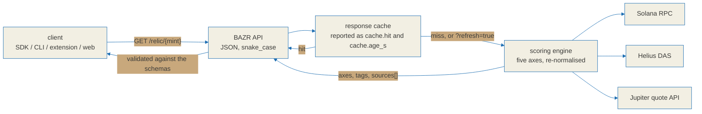

# BAZR API contract

This document fixes the **wire format** of the BAZR API: the exact JSON that
crosses the network between the scoring service and its clients. It is the
single reference that the TypeScript SDK, the CLI, the browser extension and
the web front end all implement. If one side changes a field name or a value,
every other side breaks, so the change is made here first.

Scope split, so nothing is specified twice:

| Question | Answered in |
|---|---|
| What does an axis mean and how is its score derived? | [`./relic-spec.md`](./relic-spec.md) |
| What JSON shape carries that score over HTTP? | this file |
| What evidence backs the thresholds? | [`./research.md`](./research.md) |

The TypeScript SDK mirrors this file field for field in its `src/schemas.ts`,
which lives in a separate repository,
[BazrMarket/bazr-sdk](https://github.com/BazrMarket/bazr-sdk). Every response is
parsed against those schemas before the SDK returns it, so a renamed or dropped
field raises a loud validation error instead of flowing onward as `undefined`.

The scoring service itself is not part of this repository. What is published
here are the on-chain program, the browser extension, and the specifications
every client follows. The TypeScript SDK and the `bazr` command-line client are
published in [bazr-sdk](https://github.com/BazrMarket/bazr-sdk) instead, so an
SDK file named in this document is a file in that repository, never in this one.

## What a relic score is, and is not

A relic score is a **survival-signal summary**: a weighted read of observable
on-chain state for a token that has already graduated off its launchpad. It
describes what can be measured right now about liquidity, holders, creator
control and trading continuity.

It is not a forecast. It does not estimate a future price, and it does not
claim that a token will trade again. Every relic response carries a
`disclaimer` string and clients are expected to render it verbatim:

```
Survival-signal summary, not a prediction of price or revival.
```

Values such as `revival`, or anything phrased as an outcome prediction, must
never be added to the `Verdict` enum. The three verdicts below describe
observed state, not expected state.

## Base URL

```
dev   http://localhost:8030
prod  https://<deployment-host>          (injected as NEXT_PUBLIC_API_BASE)
```

The SDK ships `http://localhost:8030` as `DEFAULT_BASE_URL` and trims trailing
slashes from whatever it is given. A base URL must start with `http://` or
`https://`.

## Conventions

- Every response is `application/json` with `snake_case` keys.
- Integer amounts denominated in base units (lamports and token atoms) cross
  the wire as **strings**. They exceed the safe integer range of a float64, so
  a number would silently lose precision.
- Timestamps are ISO 8601 strings in UTC, for example `2026-03-11T07:00:00Z`.
- Errors use one envelope with an appropriate HTTP status:
  ```jsonc
  { "error": { "code": "...", "message": "...", "detail": { } } }
  ```
- CORS is a four-domain allowlist with `allow_credentials=True`. A wildcard
  origin is not permitted.

## Request path



External data providers are named in the response rather than hidden. Every
relic response carries a `sources[]` array, and every haggle quote carries a
`source` string naming what produced the route.

## Common types

### `Verdict`

```
"dormant" | "dead" | "unclear"
```

Exactly three values. `unclear` is a real answer, used when the observable
axes disagree or too few of them could be read.

### `AxisKey`

```
"holder_dispersion" | "lp_residual" | "dev_wallet_state" | "floor_shape" | "social_afterglow"
```

Five keys, always. A relic response includes all five, including the ones that
could not be observed.

### `Axis`

```jsonc
{
  "key": "holder_dispersion",
  "label": "Holder dispersion",
  "blurb": "How spread out the remaining holders are, excluding CEX and LP wallets.",
  "score": 62,                          // 0-100. null when status is "unknown"
  "weight": 0.20,                       // pre-normalisation weight
  "contribution": 15.5,                 // what this axis actually added to the score
  "status": "ok",                       // "ok" | "unknown"
  "detail": { }                         // per-axis raw observations, rendered as evidence
}
```

`weight` is the pre-normalisation weight defined in
[`./relic-spec.md`](./relic-spec.md), which is the source of truth for these
numbers:

| Axis | Weight |
|---|---|
| `lp_residual` | 0.30 |
| `floor_shape` | 0.25 |
| `holder_dispersion` | 0.20 |
| `dev_wallet_state` | 0.15 |
| `social_afterglow` | 0.10 |
| total | 1.00 |

**An axis with `status: "unknown"` is dropped from the weighting and the
remaining weights are re-normalised. It is never folded in as a zero.** Missing
data and bad data are different events. Collapsing them would render every
token whose lookup failed as if it were dead. The SDK implements this in its
`src/score.ts`, in the [bazr-sdk](https://github.com/BazrMarket/bazr-sdk)
repository, and reports which axes were observed, which came back unknown, and
which were absent from the payload entirely.

### `Tag`

```jsonc
{
  "key": "lp-burned",
  "label": "LP burned",
  "severity": "info",        // "info" | "caution" | "alert"
  "observed": true,          // whether this is an observation rather than an inference
  "confidence": "high",      // "high" | "medium" | "low"
  "evidence": { }            // signatures, account addresses, measured values
}
```

`severity` is the size of the risk; `confidence` is how certain the call is.
They are independent, and clients render them separately so that a low-confidence
finding reads as an observation rather than a verdict. `key` is a free-form
string on the wire: clients must handle keys they do not recognise instead of
rejecting the response.

Rug and bundle findings are surfaced, not suppressed.

