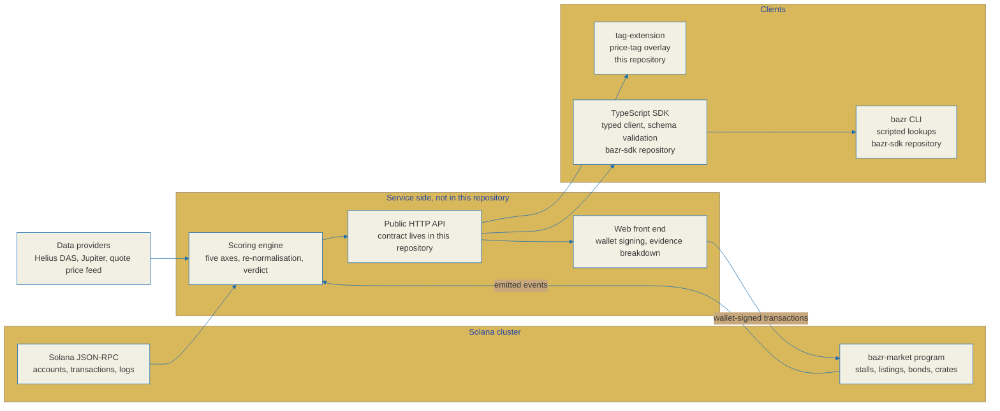

# Architecture

BAZR is a Solana meme aftermarket. It looks at tokens that already graduated from a
launchpad and then went quiet, and it prices them by survival signals instead of by
momentum. The question it answers is narrow on purpose: is this token dead, dormant,
or is the evidence too thin to say.

This document describes the layers that ship as open source, the boundary between
them and the closed service, and the path a relic score takes from an on-chain
observation to a rendered verdict.

## Honest status first

The table below is the state of each directory in this repository rather than a
description of a finished system. Where a layer is not finished, this document
says so instead of writing it up as if it were.

| Path | Layer | State |
|---|---|---|
| `anchor-program/` | On-chain program `bazr-market`, Anchor 0.31.1 | Account model, error set, event set, constants and all eleven instruction handlers are in the tree, with an integration test suite beside them. |
| `idl/` | Generated Anchor IDL, `bazr_market.json` | Eleven instructions, four accounts, eleven events and twenty-five error codes, for a client that decodes the program without building it. |
| `tag-extension/` | Chrome extension, Manifest V3 | Background service worker, content script, popup, options page and shared modules are in the tree, with 203 unit tests passing under `npm test`. |
| `docs/` | Specifications, including this file | See [relic-spec.md](./relic-spec.md), [api-contract.md](./api-contract.md) and [research.md](./research.md). |

Two clients are deliberately not here. The TypeScript SDK and the `bazr`
command-line client are published as two packages of a separate repository,
[BazrMarket/bazr-sdk](https://github.com/BazrMarket/bazr-sdk). They are described
below wherever the data flow runs through them, and every mention names the
repository they live in, so no path in this document should be read as a path in
this tree unless it is named as one.

A build artifact is only as trustworthy as the source you can read. If a claim in
this document and the code disagree, the code is right and the document is a defect.

## System view

