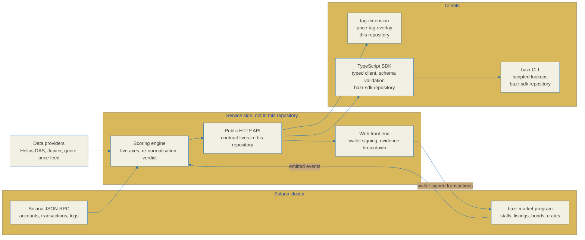

# Architecture

BAZR is a Solana meme aftermarket. It looks at tokens that already graduated from a
launchpad and then went quiet, and it prices them by survival signals instead of by
momentum. The question it answers is narrow on purpose: is this token dead, dormant,
or is the evidence too thin to say.

This document describes the layers that ship as open source, the boundary between
them and the closed service, and the path a relic score takes from an on-chain
observation to a rendered verdict.

## Honest status first

The table below is the state of each directory in this repository rather than a
description of a finished system. Where a layer is not finished, this document
says so instead of writing it up as if it were.

| Path | Layer | State |
|---|---|---|
| `anchor-program/` | On-chain program `bazr-market`, Anchor 0.31.1 | Account model, error set, event set, constants and all eleven instruction handlers are in the tree, with an integration test suite beside them. |
| `idl/` | Generated Anchor IDL, `bazr_market.json` | Eleven instructions, four accounts, eleven events and twenty-five error codes, for a client that decodes the program without building it. |
| `tag-extension/` | Chrome extension, Manifest V3 | Background service worker, content script, popup, options page and shared modules are in the tree, with 203 unit tests passing under `npm test`. |
| `docs/` | Specifications, including this file | See [relic-spec.md](./relic-spec.md), [api-contract.md](./api-contract.md) and [research.md](./research.md). |

Two clients are deliberately not here. The TypeScript SDK and the `bazr`
command-line client are published as two packages of a separate repository,
[BazrMarket/bazr-sdk](https://github.com/BazrMarket/bazr-sdk). They are described
below wherever the data flow runs through them, and every mention names the
repository they live in, so no path in this document should be read as a path in
this tree unless it is named as one.

A build artifact is only as trustworthy as the source you can read. If a claim in
this document and the code disagree, the code is right and the document is a defect.

## System view

## What each layer owns, and what it refuses to own

### On-chain program, `anchor-program/`

Owns the ledger that has to survive the service: stall registration, the bond escrow,
the append-only record of what each stall listed and how it turned out, and the crate
weighting records.

Does not own scoring. The program stores the relic score that a stall published at
listing time so the call cannot be edited afterwards; it never computes one, and it
cannot check one. It also holds no user trading funds: the only tokens it custodies
are stall bonds, in a vault owned by the market program derived address.

### Scoring engine

Owns the five axes, the re-normalisation over observable axes, and the verdict gates
described in [relic-spec.md](./relic-spec.md).

Does not own opinion. Every axis is defined over an observable on-chain fact. Price
direction and future return are not axes, and there is no field anywhere in the
contract that carries a prediction.

### Public HTTP API

Owns the wire format in [api-contract.md](./api-contract.md): snake case JSON, a
single error envelope, cursor pagination, rate limits that answer `429` with
`Retry-After` rather than returning a quiet empty body.

Does not own the formula. The contract carries `weight`, `contribution` and `status`
per axis precisely so a caller can recompute the aggregate and check it against the
spec instead of trusting the number.

### TypeScript SDK, published separately

Lives in [BazrMarket/bazr-sdk](https://github.com/BazrMarket/bazr-sdk) as its own
package. It is not in this tree.

Owns transport and trust boundaries on the client: URL building, per-attempt timeout,
retry with equal jitter, `Retry-After` handling on `429`, exponential backoff on `5xx`,
no retry on other `4xx` responses because retrying a wrong request cannot fix it. Every
response is validated against the contract schemas before it is returned, so a caller
that receives a value can rely on its shape.

Does not own chain access. The SDK opens no RPC connection, holds no key, and has one
runtime dependency, `zod`. It also re-implements the missing-axis rule locally in
`score.ts` so a rendering surface never has to fold an unobserved axis into a zero.

### Command-line client, published separately

Lives in the same [bazr-sdk](https://github.com/BazrMarket/bazr-sdk) repository as its
own package, and provides the `bazr` command. It is a thin wrapper over the SDK for
scripted lookups, so it opens no connection of its own and adds no scoring arithmetic:
anything it prints arrived through the SDK from the HTTP API. Nothing in this
repository provides a `bazr` command, so a reader who wants that source should go to
the other repository.

### Browser extension, `tag-extension/`

Owns a read-only overlay: it recognises Solana mint addresses on pages a user already
visits and hangs a price tag on them carrying the relic verdict and the axis breakdown.

Does not own a wallet connection, transaction signing, or any provider credential. Its
whole message surface is reads, settings and cache control, and the only network
origins compiled into it are the BAZR API origins.

