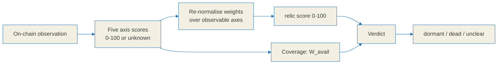

# Relic score specification

**The relic score is a survival-signal summary, not a prediction.** It compresses five
observable on-chain properties of a graduated Solana meme token into one number between
0 and 100 and one of three verdicts. It does not forecast price, it does not estimate the
probability that a token trades again, and it must never be presented as a reason to buy
or sell anything.

Every value in this document is a function of observation. Nothing here is calibrated
against future returns, because no return data is used anywhere in the pipeline.

This file is the reference specification. The wire format is defined in
[`./api-contract.md`](./api-contract.md), the label rules in
[`./tag-spec.md`](./tag-spec.md), and the re-normalisation is implemented in
the TypeScript SDK's `src/score.ts`, which lives in a separate repository,
[BazrMarket/bazr-sdk](https://github.com/BazrMarket/bazr-sdk). If this document and the
implementation disagree, that is a bug in one of them, and this document is the side
that gets corrected first.

---

## 0. Honesty constraints

These constraints govern the whole specification. They are design requirements, not
disclaimers bolted on afterwards.

1. **The score summarises survival signals.** Vocabulary that implies certainty, price
   multiples, imminent price movement, or a trade recommendation is excluded from every
   field, label, blurb and rendered string. The verdict enum is deliberately closed:
   `dormant | dead | unclear`, and nothing else may be added to it.
2. **All five axes are defined over observable on-chain facts.** Price direction and
   future return are not inputs to any axis.
3. **A score is a point-in-time snapshot.** Every response carries `scored_at` plus the
   `fetched_at` of each source, so a stale read is visible rather than implied.
4. **Every axis is decomposed in the response.** The client can show precisely how much
   each axis contributed, which is why each axis must always emit a `detail` object
   describing what was actually observed.
5. **Missing data is `unknown`, never 0.** "We could not observe this" and "this is bad"
   are different events. Collapsing them makes every token whose data lookup failed
   render as dead. Section 8 defines how missing axes are handled instead.

---

