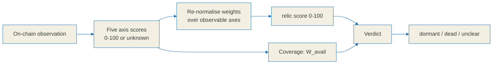
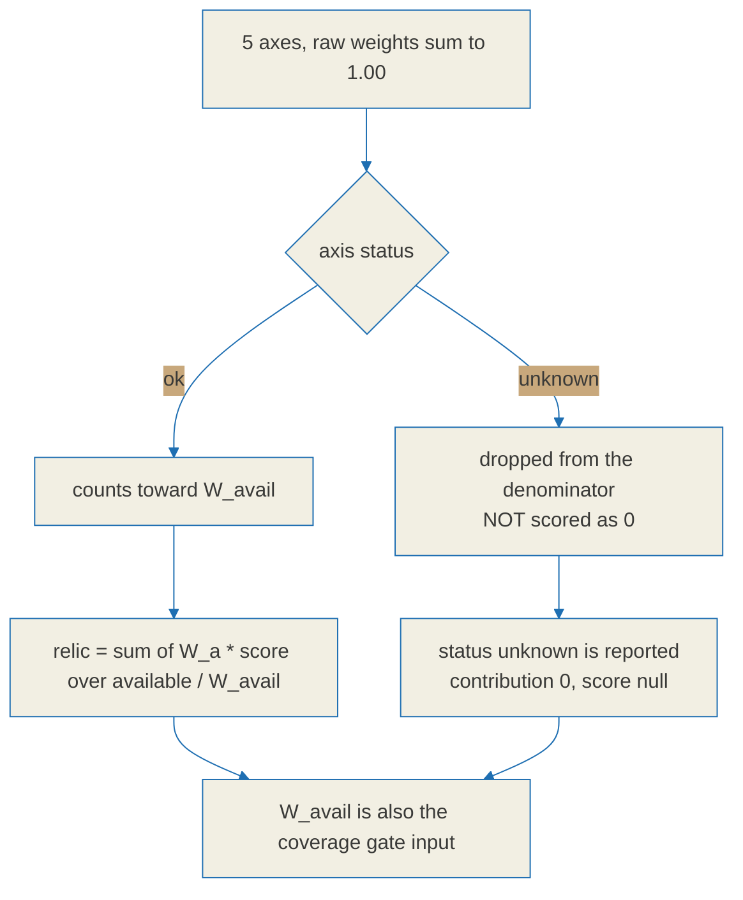
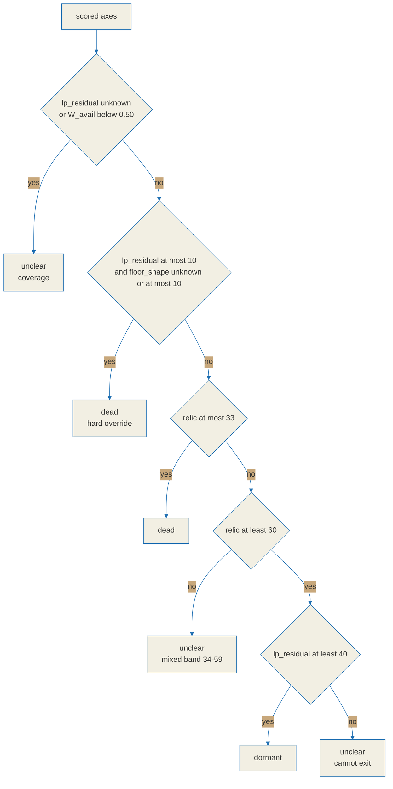

# Relic score specification

**The relic score is a survival-signal summary, not a prediction.** It compresses five
observable on-chain properties of a graduated Solana meme token into one number between
0 and 100 and one of three verdicts. It does not forecast price, it does not estimate the
probability that a token trades again, and it must never be presented as a reason to buy
or sell anything.

Every value in this document is a function of observation. Nothing here is calibrated
against future returns, because no return data is used anywhere in the pipeline.

This file is the reference specification. The wire format is defined in
[`./api-contract.md`](./api-contract.md), the label rules in
[`./tag-spec.md`](./tag-spec.md), and the re-normalisation is implemented in
the TypeScript SDK's `src/score.ts`, which lives in a separate repository,
[BazrMarket/bazr-sdk](https://github.com/BazrMarket/bazr-sdk). If this document and the
implementation disagree, that is a bug in one of them, and this document is the side
that gets corrected first.

---

## 0. Honesty constraints

These constraints govern the whole specification. They are design requirements, not
disclaimers bolted on afterwards.

1. **The score summarises survival signals.** Vocabulary that implies certainty, price
   multiples, imminent price movement, or a trade recommendation is excluded from every
   field, label, blurb and rendered string. The verdict enum is deliberately closed:
   `dormant | dead | unclear`, and nothing else may be added to it.
2. **All five axes are defined over observable on-chain facts.** Price direction and
   future return are not inputs to any axis.
3. **A score is a point-in-time snapshot.** Every response carries `scored_at` plus the
   `fetched_at` of each source, so a stale read is visible rather than implied.
4. **Every axis is decomposed in the response.** The client can show precisely how much
   each axis contributed, which is why each axis must always emit a `detail` object
   describing what was actually observed.
5. **Missing data is `unknown`, never 0.** "We could not observe this" and "this is bad"
   are different events. Collapsing them makes every token whose data lookup failed
   render as dead. Section 8 defines how missing axes are handled instead.



---

## 1. Notation and shared helpers

```text
clamp(x, lo, hi) = max(lo, min(hi, x))

lerp(x, x0, x1, y0, y1):              # map x from [x0,x1] onto [y0,y1], clamped at both ends
    if x1 == x0: return y0
    t = clamp((x - x0) / (x1 - x0), 0, 1)
    return y0 + t * (y1 - y0)

loglerp(x, x0, x1, y0, y1) = lerp(log10(max(x,1)), log10(x0), log10(x1), y0, y1)
```

`loglerp` exists because liquidity and holder counts are heavy-tailed. A linear map over
those quantities spends almost its entire output range on the top percentile.

- Token amounts are normalised by decimals (`raw / 10^decimals`) before use.
- USD conversion multiplies by the quote asset price (WSOL to USD, USDC = 1). The SOL/USD
  reference price is an external dependency; when it cannot be observed, the dependent
  axis becomes `unknown`. It is never filled in with an estimate.
- Default trailing window: `W = 30 days`. Recency is evaluated on UTC day boundaries.
- Axis scores are integers in `0..100`, where higher means a stronger survival signal or
  lower residual risk. When an axis cannot be computed it is `unknown`, not 0.

### 1.1 Exclusion set

Several axes need to know which token accounts do not represent a real holder.

```text
EXCLUDE(mint) = AMM_POOL_VAULTS(mint)     # base/quote vault ATAs of every discovered pool
              + KNOWN_CEX(mint)           # maintained label list; may be empty
              + BURN_ADDRS                # e.g. 1nc1nerator11111111111111111111111111111111
              + INSIDER_CLUSTER(mint)     # bundle/sniper clusters from the tag labeler, optional input
```

- `AMM_POOL_VAULTS` covers PumpSwap `pool_base_token_account`, Raydium vaults and any
  other discovered pool. **Excluding these is mandatory.** A pool vault holds a large
  share of the float by construction, so leaving it in makes an ordinary token look
  totally captured by a single wallet. Published work on holder concentration reports
  that failing to exclude protocol-controlled addresses inflates measured concentration
  by a median factor of 2.3x and up to 18x.
- When `KNOWN_CEX` is empty, scoring proceeds and sets `cex_list_missing = true` in the
  axis detail. The effect on this domain is small, but it is surfaced rather than hidden.
- `INSIDER_CLUSTER` is optional. It is populated by the `bundle-launch` and
  `sniper-cluster` labels described in [`./tag-spec.md`](./tag-spec.md), and those labels
  are heuristic, so this input carries their false-positive risk into axis 1.

---

## 2. Axis 1 - `holder_dispersion`

**Observation target:** how widely real holders are spread across the *effective float*,
after pool, exchange, burn and insider wallets are removed.

| Field | Value |
| --- | --- |
| `label` | `Holder spread` |
| `blurb` | `How widely the real holders are spread, after removing pool, exchange, burn and insider wallets.` |

### Inputs

```text
accounts = getTokenAccounts(mint), fully paginated (1000/page, burnt=false, amount>0)
holders  = accounts aggregated by owner, minus EXCLUDE(mint)
float    = sum(holders.amount)                       # effective circulating supply
sort holders desc by amount
top1     = holders[0].amount / float
top10    = sum(holders[0..9].amount) / float
n_eff    = count(holders where amount/float >= 1e-4) # ignore dust
HHI      = 10000 * sum((amount_i/float)^2)           # reported for transparency, not scored
```

### Scoring

```text
base = lerp(top10, 0.20, 0.85, 100, 0)      # top10 at 20% -> 100, at 85% -> 0
if top1 >= 0.35: base = min(base, 25)        # single wallet above 35%
if top1 >= 0.50: base = min(base, 10)        # single wallet holds effective control
if n_eff < 50:   base = min(base, lerp(n_eff, 10, 50, 20, 60))
holder_dispersion = round(clamp(base, 0, 100))
```

The `n_eff` cap exists because a token can be perfectly "dispersed" across eight wallets.
Dispersion of a tiny holder set is not the same signal as dispersion of a large one.

**`unknown` when:** `getTokenAccounts` fails, `float <= 0`, or `n_eff == 0`.

**`detail`:** `{ top1, top10, n_eff, hhi, float, excluded_counts: { pools, cex, burn, insider }, cex_list_missing }`

**Notes and failure modes.** The 30% top-10 and 35% single-wallet lines follow common
concentration-review practice. HHI is reported but not scored: it is largely redundant
with `top10`, and scoring both would double-count the same structure. The largest
practical error source is an incomplete `EXCLUDE` set, which biases this axis *downward*
(more apparent concentration than really exists).

---

## 3. Axis 2 - `lp_residual`

**Observation target:** how much real exit liquidity remains on the quote side, and
whether that liquidity is burned, locked, or still pullable.

| Field | Value |
| --- | --- |
| `label` | `Liquidity left` |
| `blurb` | `Real quote-side liquidity still in the pool(s), and whether that liquidity is burned, locked, or still pullable.` |

### Inputs

```text
pools = discover_pools(mint)                  # PumpSwap PDA, Raydium, and any other AMM found
for p in pools:
    p.quote_usd = balance(p.pool_quote_token_account) * quote_price_usd(p.quote_mint)
    p.lp_state  = classify_lp(p)              # "burned" | "locked" | "unlocked"
quote_usd = sum(p.quote_usd)                  # summed across all pools
graduated = has_migration_record(mint)
```

```text
classify_lp(p):
    burn_pct = ((max(supply, lpReserve-1) - supply) / max(supply, lpReserve-1)) * 100
    if burn_pct >= 99 or migrate_burn_confirmed(p): return "burned"
    if lp_held_by_known_locker(p) and unlock_time > now: return "locked"
    return "unlocked"
```

### Scoring

```text
depth = loglerp(quote_usd, 300, 30000, 0, 100)     # $300 -> 0 (no exit), $30k -> 100

if all pools in {burned, locked}:
    sec = 0                                        # already safe, no adjustment
else:
    pull_share = sum(quote_usd of unlocked pools) / max(quote_usd, 1)
    sec = -lerp(pull_share, 0.20, 1.0, 0, 40)      # up to -40 as pullable share grows

lp_residual = round(clamp(depth + sec, 0, 100))
```

### `unknown` versus a confirmed 0

This distinction is the reason the axis exists in this form. Not finding a pool and
confirming a pool is empty are different observations.

```text
if pools is empty and graduated == true:   lp_residual = 0        # migrated, yet no pool -> confirmed thin/dead
if pools is empty and graduated != true:   lp_residual = unknown  # not found or not indexed -> undecidable
if quote_price_usd cannot be observed:     lp_residual = unknown
```

**`detail`:** `{ quote_usd, pools: [{ amm, quote_usd, lp_state, burn_pct, unlock_time }], graduated }`

**Notes and failure modes.** Post-graduation death shows up as depth collapse rather than
as a price move, which is why depth is measured directly. Only the **quote side** counts:
token-side balance is not exit liquidity, since selling into it is exactly what fails.
The `$300` floor encodes the practical point at which exiting a position is no longer
possible. The three LP states are ordered by strength: burned is permanent, locked is
temporary and expires, unlocked is a live withdrawal vector. Known error sources are
undiscovered pools (biases the axis down, reads as thinner than reality), unknown locker
programs (a locked LP read as `unlocked`, also biasing down), and stale reserve reads.
The bias direction is deliberate: this axis prefers to understate liquidity rather than
overstate it.

---

## 4. Axis 3 - `dev_wallet_state`

**Observation target:** the residual control and supply overhang the creator still holds,
including whether mint or freeze authority is still live.

| Field | Value |
| --- | --- |
| `label` | `Creator overhang` |
| `blurb` | `Residual control the creator still holds: remaining supply, recent large moves, and whether mint or freeze authority is still live.` |

### Inputs

```text
mint_live   = (mintAuthority   != null)
freeze_live = (freezeAuthority != null)
creator     = identify_creator(mint)   # heuristic: creation-tx signer / first funder /
                                       #   pump.fun creator record / PumpSwap coin_creator
dev_pct        = creator ? sum(creator balances) / total_supply : unknown
dev_recent_out = creator ? creator outflow over the last 7 days / total_supply : unknown
```

### Scoring

```text
score = 100
if mint_live:   score -= 50                          # further issuance possible
if freeze_live: score -= 45                          # transfers can be blocked
if dev_pct != unknown:
    score -= lerp(dev_pct, 0.03, 0.30, 0, 30)        # 3% -> 0, 30%+ -> -30 supply overhang
    score -= lerp(dev_recent_out, 0.05, 0.40, 0, 15) # recent large outflow
dev_wallet_state = round(clamp(score, 0, 100))
```

### Partial-observation rule

Authority fields are almost always readable. If only the creator cannot be identified,
the axis is still scored from the authority fields alone, the `dev_pct` and
`dev_recent_out` terms are dropped, and `detail.creator_resolved` is set to `false`. If
the authority fields themselves cannot be read, the axis is `unknown`.

**`detail`:** `{ mint_live, freeze_live, creator, creator_resolved, dev_pct, dev_recent_out }`

**Notes and failure modes.** A null authority is a confirmed on-chain fact, so that half
of the axis is high confidence. Mint authority is weighted more heavily than freeze
authority because unlimited issuance is more destructive than blocked transfers. Note
that pump.fun revokes mint authority by default but **does not always revoke freeze**, so
the state must be read per token rather than assumed. Creator identification is the weak
half: proxy funding, paid-for deployments and reused wallets all produce misattribution.
A creator who has fully exited scores 100 here by design, because this axis measures
residual *control*, not abandonment. Abandonment is picked up by `floor_shape` and
`social_afterglow`, and double-counting it here would punish the same fact twice.

---

## 5. Axis 4 - `floor_shape`

**Observation target:** persistence of trading, not price. Does a minimal level of
execution keep happening day after day, and does it involve more than a couple of wallets.

| Field | Value |
| --- | --- |
| `label` | `Trading floor` |
| `blurb` | `How consistently the token still trades day over day. This measures persistence of fills, not price.` |

### Inputs

```text
swaps = all swaps across all pools over the last W = 30 days
for each day d in [0..W):
    fills_d   = number of swaps on day d
    traders_d = number of distinct signing wallets on day d
    active(d) = (fills_d >= 5) and (traders_d >= 3)
active_days = count of active days
since_last  = days elapsed since the most recent active day (W if there is none)
gap_max     = longest run of consecutive inactive days
```

### Scoring

```text
ratio = active_days / W
base  = lerp(ratio, 0.05, 0.80, 0, 100)     # 5% of days active -> 0, 80% -> 100
base -= lerp(since_last, 2, 14, 0, 45)      # active within 2 days -> 0, 14+ days -> -45
floor_shape = round(clamp(base, 0, 100))
```

**`unknown` when:** swap history cannot be retrieved. If only part of the window is
retrievable, score over the retrieved span and narrow `detail.window_days` accordingly;
if that span is shorter than 7 days, the axis is `unknown`.

**`detail`:** `{ active_days, window_days, since_last, gap_max, fills_total, distinct_traders_total, fill_threshold: 5, trader_threshold: 3 }`

**Notes and failure modes.** Most graduated tokens stop trading within 24 to 48 hours, so
continued execution is the most direct evidence of survival available on-chain. Price is
excluded on purpose. The `traders_d >= 3` gate is a wash-trading defence: two wallets
passing a position back and forth can manufacture a convincing fill cadence, and the
distinct-wallet requirement raises the cost of that. It does not eliminate it - a
determined actor with several funded wallets still clears this gate. The thresholds of
`fills >= 5` and `>= 3 traders` are deliberately low, because this specification targets
faint-but-real floors in dead meme tokens, not active new launches. Applying these
thresholds to a live launch would produce meaningless full marks.

---

## 6. Axis 5 - `social_afterglow`

**Observation target:** the on-chain trace of lingering attention - first-time holders,
breadth of distinct active wallets, and holder-count trend. The primary definition uses
on-chain data only, so the axis works without any external social API.

| Field | Value |
| --- | --- |
| `label` | `Afterglow` |
| `blurb` | `On-chain traces of lingering attention: new first-time holders, breadth of distinct active wallets, and holder-count trend.` |

### Inputs, on-chain approximation over `W = 30 days`

```text
new_holders    = wallets that acquired this mint for the first time ever within W
unique_traders = distinct wallets that traded within W
holder_now     = current effective holder count (reuses n_eff from axis 1)
holder_prev    = holder count W days ago (snapshot/history)
trend          = (holder_now - holder_prev) / max(holder_prev, 1)
```

### Scoring

```text
breadth = lerp(unique_traders, 3, 150, 0, 60)     # breadth caps at 60
inflow  = lerp(new_holders,    1, 80,  0, 25)     # new entrants cap at 25
trendc  = lerp(trend, -0.30, 0.20, -15, 15)       # shrinking negative, growing positive
social_afterglow = round(clamp(breadth + inflow + trendc, 0, 100))
```

### Optional external social input

The axis is complete without it. When an external social source is used:

- `detail.social_source` must name the source.
- The final axis value is a weighted mean of `on-chain 0.7 / social 0.3`.
- The limitations must be recorded in `detail`: social data is (a) manipulable by bots and
  coordinated posting, (b) rate limited, and (c) usually absent entirely for dead tokens.
  Social input is therefore a capped auxiliary term, never the primary value.

**`unknown` when:** trade history and holder snapshots (current and historical) are *both*
unavailable. If any component is available, score from the available components, treat the
missing components as contributing 0, and record which ones were missing in `detail`.

**`detail`:** `{ new_holders, unique_traders, holder_now, holder_prev, trend, social_source, on_chain_only }`

**Separation from `floor_shape` (no double counting).** `floor_shape` measures the
*cadence* of execution: is trading happening at all. `social_afterglow` measures the
*breadth* of participants, new entry and holder trend: is new attention arriving. The two
can and do diverge. Two wallets wash trading produce a floor cadence with near-zero
breadth and inflow; a burst of new holders can appear while the fill cadence stays
sporadic. Implementations must not fold these two axes into a shared computation.

**This is the weakest and most manipulable axis in the specification.** Wallet creation is
cheap, so `new_holders` and `unique_traders` can both be inflated by an actor willing to
spend a small amount on transaction fees. That is the reason it carries the lowest weight
in section 7, and the reason external social data is capped at 0.3 of the axis rather than
being allowed to drive it.

---

## 7. Weights

```text
W_lp_residual       = 0.30
W_floor_shape       = 0.25
W_holder_dispersion = 0.20
W_dev_wallet_state  = 0.15
W_social_afterglow  = 0.10
                      ----
total                 1.00
```

| Axis | Weight | Reasoning |
| --- | --- | --- |
| `lp_residual` | 0.30 | Primary determinant of the question this score answers. With no exit liquidity, every other axis is academic. |
| `floor_shape` | 0.25 | The most direct evidence of continued activity. Most graduated tokens stop trading entirely. |
| `holder_dispersion` | 0.20 | Structural risk. Good dispersion does not save a token with no liquidity, but extreme concentration degrades the quality of what remains. |
| `dev_wallet_state` | 0.15 | Residual control risk. Graduated tokens frequently have both authorities already revoked, which lowers this axis's discriminating power. |
| `social_afterglow` | 0.10 | On-chain approximation of attention and the most manipulable input. Lowest weight by construction. |

These raw weights are transported in `Axis.weight` (pre-normalisation) as defined in
[`./api-contract.md`](./api-contract.md).

---

## 8. Aggregation and missing-axis re-normalisation

```text
axes      = { lp_residual, floor_shape, holder_dispersion, dev_wallet_state, social_afterglow }
available = { a in axes : a.score != unknown }
W_avail   = sum(W_a for a in available)

if W_avail == 0:
    return { score: null, verdict: "unclear", reason: "no observable axis" }

relic = sum(W_a * a.score for a in available) / W_avail        # 0..100

for a in axes:
    a.status       = (a in available) ? "ok" : "unknown"
    a.contribution = (a in available) ? (W_a / W_avail) * a.score : 0
    # invariant: sum(a.contribution) == relic

relic = round(relic)
```

### Why missing axes leave the denominator instead of scoring 0

This is the central honesty mechanism of the specification, so it is worth stating
plainly. Suppose four axes are observable and score well, and the fifth cannot be read
because an indexer is behind.

- Folding the missing axis in as 0 would drop the aggregate by up to 30 points and could
  flip the verdict to `dead`. The token did not change. Our visibility did.
- Under that rule, every degradation of our own data pipeline would be published as
  evidence that tokens are dying. The score would silently measure our uptime.
- Re-normalising instead means the reported score is the honest weighted mean of *what was
  actually observed*, and the fact that something was not observed is reported separately
  through `status: "unknown"` and the coverage gate in section 9.



`contribution` is the amount an axis actually added to the final score. A rendering
surface can lay the five contributions side by side and they will sum to the score.

**Reconciliation with the SDK.** The TypeScript SDK's `src/score.ts`, in the
[bazr-sdk](https://github.com/BazrMarket/bazr-sdk) repository, implements this as
`normalizedScore()`. Because the contract requires every response to
carry all five axes, the SDK's `weightCoverage` (observable weight divided by weight
present in the payload) equals `W_avail` here. The SDK also exposes two things this
document does not compute: `equalWeightFallback`, set when every observable axis arrived
with weight 0 and an equal-weight mean had to be used instead - surfaced rather than
hidden, because it means the API sent unusable weights - and `missing`, listing canonical
axes absent from the payload entirely, which is a contract violation on the server side.

---

## 9. Verdict thresholds

Rules are evaluated in order. The first rule that matches decides the verdict.

```text
  # (1) coverage gate - an honest "unclear"
  if lp_residual.status == "unknown":            verdict = "unclear"; reason = "no liquidity read"
  elif W_avail < 0.50:                           verdict = "unclear"; reason = "insufficient coverage"

  # (2) hard dead override - both deciding axes are at the floor
  elif lp_residual.score <= 10
       and (floor_shape.status == "unknown" or floor_shape.score <= 10):
                                                 verdict = "dead";    reason = "no exit liquidity, no trading floor"

  # (3) band verdict
  elif relic <= 33:                              verdict = "dead"
  elif relic >= 60:
       if lp_residual.score >= 40:               verdict = "dormant"
       else:                                     verdict = "unclear"; reason = "high aggregate but cannot exit"
  else:  # 34..59
                                                 verdict = "unclear"
```

| Condition | Verdict |
| --- | --- |
| `lp_residual` is `unknown`, or `W_avail < 0.50` | `unclear` (coverage) |
| `lp_residual <= 10` and (`floor_shape` is `unknown` or `<= 10`) | `dead` (hard override) |
| `relic <= 33` | `dead` |
| `relic >= 60` and `lp_residual >= 40` | `dormant` |
| `relic >= 60` but `lp_residual < 40` | `unclear` (aggregate is high but exit is not possible) |
| `34 <= relic <= 59` | `unclear` (genuinely mixed) |



**Why three verdicts instead of two.** The 34 to 59 band is where survival signals
genuinely conflict: liquidity says one thing, trading says another. Forcing a binary
choice there would manufacture confidence that the observations do not support. Reporting
`unclear` is the accurate answer, and it is the answer this tool is willing to give often.

**Why a high aggregate can still be `unclear`.** If `relic >= 60` but `lp_residual < 40`,
the token cannot be called dormant, because "dormant" implies it can trade again. A
position that cannot be exited is not a sleeping position. When the aggregate and a
deciding axis disagree, the deciding axis wins.

---

## 10. Worked example

Hypothetical observations, included so an implementation can check itself end to end.

```text
holder_dispersion: top10=0.45, top1=0.22, n_eff=180
                   base = lerp(0.45, 0.20, 0.85, 100, 0) = 61.5 -> 62

lp_residual:       quote_usd = $4,200, all pools burned
                   depth = loglerp(4200, 300, 30000, 0, 100)
                         = lerp(log10 4200 = 3.623, log10 300 = 2.477, log10 30000 = 4.477, 0, 100)
                         = (3.623 - 2.477) / (4.477 - 2.477) * 100 = 57.3
                   sec = 0 -> 57

floor_shape:       active_days = 9/30, since_last = 3
                   lerp(0.30, 0.05, 0.80, 0, 100) = 33.3
                   -lerp(3, 2, 14, 0, 45) = -15 -> 18

dev_wallet_state:  mint = null, freeze = null, dev_pct = 0.06, dev_recent_out = 0
                   100 - lerp(0.06, 0.03, 0.30, 0, 30) = 100 - 3.3 = 96.7 -> 97

social_afterglow:  unique_traders = 40, new_holders = 12, trend = -0.05
                   breadth = lerp(40, 3, 150, 0, 60)   = 15.1
                   inflow  = lerp(12, 1, 80, 0, 25)    =  3.5
                   trendc  = lerp(-0.05, -0.30, 0.20, -15, 15) = 0
                   total = 18.6 -> 19
```

Aggregation with all five axes available, `W_avail = 1.00`:

```text
relic = 0.30*57 + 0.25*18 + 0.20*62 + 0.15*97 + 0.10*19
      = 17.1 + 4.5 + 12.4 + 14.55 + 1.9
      = 50.45 -> 50

verdict: lp_residual is ok, W_avail = 1.0, lp_residual > 10, relic = 50 is in 34..59
      -> "unclear"

contributions: lp 17.1 / floor 4.5 / holder 12.4 / dev 14.55 / social 1.9   (sum 50.45 = relic)
```

Read in words: liquidity is burned and still present, holders are reasonably spread, but
the trading floor has cooled recently. There is not enough agreement between the axes to
call this dead, and not enough exit-side confidence to call it dormant. `unclear` is the
correct output, and an implementation that reports something more decisive here is wrong.

---

## 11. Output shape

Each element of `axes[]` in `GET /relic/{mint}` follows `Axis` in
[`./api-contract.md`](./api-contract.md):

```jsonc
{
  "key": "lp_residual",
  "label": "Liquidity left",
  "blurb": "Real quote-side liquidity still in the pool(s), and whether it is burned, locked, or pullable.",
  "score": 57,                 // null when status is "unknown"
  "weight": 0.30,              // raw weight from section 7, before re-normalisation
  "contribution": 17.1,        // section 8: (W_a / W_avail) * score
  "status": "ok",              // "ok" | "unknown"
  "detail": { "quote_usd": 4200, "pools": [ /* ... */ ], "graduated": true }
}
```

- Top-level `score` is `relic` from section 8, or `null` when no axis was observable.
- Top-level `verdict` follows section 9, and `disclaimer` is always present.
- **Every response carries all five axes.** An axis that could not be observed is included
  with `status: "unknown"` and `score: null`. Axes are never omitted, because an omitted
  axis is indistinguishable from an axis that was never defined.

Canonical display labels are the ones listed per axis above. The TypeScript SDK also ships
`AXIS_FALLBACK_LABELS` in its `src/schemas.ts`, in the separate
[bazr-sdk](https://github.com/BazrMarket/bazr-sdk) repository; those are
key-derived names used only when a payload omits an axis entirely, so a rendering surface
always has some string to show.

---

