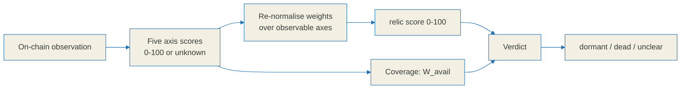

# Relic score specification

**The relic score is a survival-signal summary, not a prediction.** It compresses five
observable on-chain properties of a graduated Solana meme token into one number between
0 and 100 and one of three verdicts. It does not forecast price, it does not estimate the
probability that a token trades again, and it must never be presented as a reason to buy
or sell anything.

Every value in this document is a function of observation. Nothing here is calibrated
against future returns, because no return data is used anywhere in the pipeline.

This file is the reference specification. The wire format is defined in
[`./api-contract.md`](./api-contract.md), the label rules in
[`./tag-spec.md`](./tag-spec.md), and the re-normalisation is implemented in
the TypeScript SDK's `src/score.ts`, which lives in a separate repository,
[BazrMarket/bazr-sdk](https://github.com/BazrMarket/bazr-sdk). If this document and the
implementation disagree, that is a bug in one of them, and this document is the side
that gets corrected first.

---

## 0. Honesty constraints

These constraints govern the whole specification. They are design requirements, not
disclaimers bolted on afterwards.

1. **The score summarises survival signals.** Vocabulary that implies certainty, price
   multiples, imminent price movement, or a trade recommendation is excluded from every
   field, label, blurb and rendered string. The verdict enum is deliberately closed:
   `dormant | dead | unclear`, and nothing else may be added to it.
2. **All five axes are defined over observable on-chain facts.** Price direction and
   future return are not inputs to any axis.
3. **A score is a point-in-time snapshot.** Every response carries `scored_at` plus the
   `fetched_at` of each source, so a stale read is visible rather than implied.
4. **Every axis is decomposed in the response.** The client can show precisely how much
   each axis contributed, which is why each axis must always emit a `detail` object
   describing what was actually observed.
5. **Missing data is `unknown`, never 0.** "We could not observe this" and "this is bad"
   are different events. Collapsing them makes every token whose data lookup failed
   render as dead. Section 8 defines how missing axes are handled instead.



---

## 1. Notation and shared helpers

```text
clamp(x, lo, hi) = max(lo, min(hi, x))

lerp(x, x0, x1, y0, y1):              # map x from [x0,x1] onto [y0,y1], clamped at both ends
    if x1 == x0: return y0
    t = clamp((x - x0) / (x1 - x0), 0, 1)
    return y0 + t * (y1 - y0)

loglerp(x, x0, x1, y0, y1) = lerp(log10(max(x,1)), log10(x0), log10(x1), y0, y1)
```

`loglerp` exists because liquidity and holder counts are heavy-tailed. A linear map over
those quantities spends almost its entire output range on the top percentile.

- Token amounts are normalised by decimals (`raw / 10^decimals`) before use.
- USD conversion multiplies by the quote asset price (WSOL to USD, USDC = 1). The SOL/USD
  reference price is an external dependency; when it cannot be observed, the dependent
  axis becomes `unknown`. It is never filled in with an estimate.
- Default trailing window: `W = 30 days`. Recency is evaluated on UTC day boundaries.
- Axis scores are integers in `0..100`, where higher means a stronger survival signal or
  lower residual risk. When an axis cannot be computed it is `unknown`, not 0.

### 1.1 Exclusion set

Several axes need to know which token accounts do not represent a real holder.

```text
EXCLUDE(mint) = AMM_POOL_VAULTS(mint)     # base/quote vault ATAs of every discovered pool
              + KNOWN_CEX(mint)           # maintained label list; may be empty
              + BURN_ADDRS                # e.g. 1nc1nerator11111111111111111111111111111111
              + INSIDER_CLUSTER(mint)     # bundle/sniper clusters from the tag labeler, optional input
```

- `AMM_POOL_VAULTS` covers PumpSwap `pool_base_token_account`, Raydium vaults and any
  other discovered pool. **Excluding these is mandatory.** A pool vault holds a large
  share of the float by construction, so leaving it in makes an ordinary token look
  totally captured by a single wallet. Published work on holder concentration reports
  that failing to exclude protocol-controlled addresses inflates measured concentration
  by a median factor of 2.3x and up to 18x.
- When `KNOWN_CEX` is empty, scoring proceeds and sets `cex_list_missing = true` in the
  axis detail. The effect on this domain is small, but it is surfaced rather than hidden.
- `INSIDER_CLUSTER` is optional. It is populated by the `bundle-launch` and
  `sniper-cluster` labels described in [`./tag-spec.md`](./tag-spec.md), and those labels
  are heuristic, so this input carries their false-positive risk into axis 1.

---

