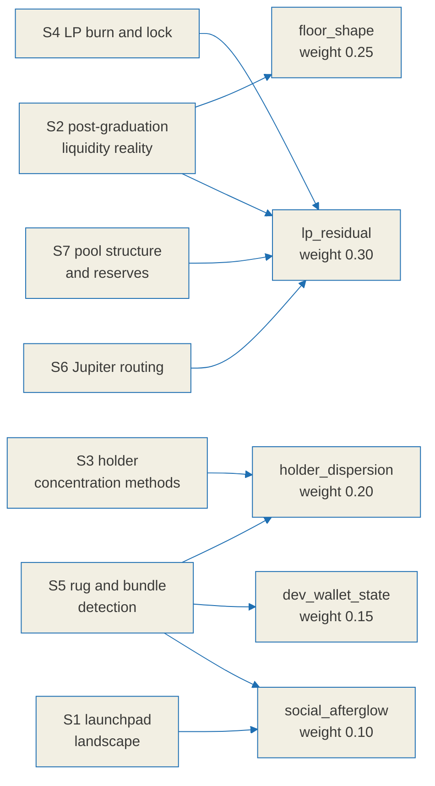

# Relic score research notes

This is the evidence ledger behind [`./relic-spec.md`](./relic-spec.md) and the
label rules it implements. Its purpose is to show that every formula, weight and
threshold in the specification rests on something observed rather than on
intuition, and to be equally explicit about the places where the evidence runs
out.

On-chain figures are time dependent, so the specification does not hard-code any
of the numbers below. It observes them at runtime and records what it saw.

## Confidence labels

Every claim in this document carries one of three labels. They are used
consistently and they mean exactly this:

| Label | Meaning |
|---|---|
| `[verified]` | Confirmed against a primary source, which is linked inline. |
| `[estimate]` | Supported by evidence, but no single figure can be pinned down. Ranges, or agreement across secondary sources without a primary one. |
| `[unverified]` | Investigated and **not** confirmed. The primary check failed or no free primary source exists. Section 8 lists all of these in one place. |

An `[unverified]` item is never promoted to a fact elsewhere in the
specification. Each one is absorbed either as an explicit unknown state or as a
reduction in the confidence attached to a label.

## Method and limits

- Primary sources were preferred: official documentation, papers on arXiv and
  SSRN, and API references. Secondary blog posts were used only for cross-checking.
- **Two arXiv PDFs could not be parsed.** For `2512.00377` (memecoin fragility,
  a 3.2MB body) the PDF streams were compressed and body figures could not be
  extracted. Only abstract-level framing was obtained, so anything that would
  have depended on that body text is labelled `[unverified]`.
- **No free canonical on-chain source of CEX wallet labels was found.** This is
  a known bias source for the holder dispersion axis and is handled explicitly
  in the specification rather than ignored.

## How the evidence reaches the score

---

## 1. Solana meme launchpad landscape, 2025 to 2026

### 1.1 pump.fun bonding curve graduation `[verified]`

- A bonding curve completes at roughly **85 SOL of real reserves**, on top of
  which **30 SOL of virtual reserves** bootstrap the price. That corresponds to
  roughly **$69,000** of market capitalisation, depending on the SOL price at
  the time. Sources: [pump.fun bonding curve docs](https://pump.fun/docs/bonding-curve),
  [arXiv 2607.02823](https://arxiv.org/html/2607.02823),
  [crypto.news](https://crypto.news/how-meme-coins-are-made-bonding-curves-pump-fun-rug-pulls/)
- **The destination changed, and that matters.** Tokens that graduated before
  2025-03 migrated to **Raydium**. After the launch of **PumpSwap**, pump.fun's
  own AMM, in 2025-03, they migrate to PumpSwap instead. Sources:
  [Bitquery pump-fun-to-pump-swap](https://docs.bitquery.io/docs/blockchain/Solana/Pumpfun/pump-fun-to-pump-swap/),
  [Smithii](https://smithii.io/en/graduate-token-pump-fun/)
- **LP tokens are burned at graduation**, so migrated liquidity cannot be pulled
  back out. This covers the migrated liquidity only, not liquidity added
  afterwards. Sources: Bitquery and Smithii above,
  [DeepWiki: pump.fun liquidity docs](https://deepwiki.com/pump-fun/pump-public-docs/4.4-liquidity-management)

### 1.2 Graduation rates `[verified + estimate]`

The figure depends entirely on the measurement window. **There is no single
true graduation rate**, so the specification does not use this number at all.
Graduation is decided per token from the on-chain migration itself.

| Window | Rate | Character | Source |
|---|---|---|---|
| 2026-05 to 06, 832,941 launches | 0.198% (95% CI 0.189 to 0.208) | **Lower bound**; the collector could only track graduations within 6 minutes | [arXiv 2607.02823](https://arxiv.org/html/2607.02823) |
| 2025-09 to 10, 655,770 sample | 0.63% | Prior work (Marino et al.) | [arXiv 2607.02823](https://arxiv.org/html/2607.02823), citing |
| 2025-04 | 0.37% to 1.78% | Daily variation | [bitcoinke](https://bitcoinke.io/2025/03/pump-fun-memecoins-survival-rate/) |
| Summer 2025 | 0.92% | | [MEXC](https://www.mexc.com/news/586607) |
| Separate tally | 1.4% graduate; 3% of users clear $1,000 or more in profit | | [Bitget](https://www.bitget.com/news/detail/12560604161427) |

- **Social presence raises the graduation rate substantially** `[verified]`:
  tokens advertised on Telegram graduated at 1.485% against 0.166% for
  unadvertised ones, about 8.94 times higher, with a Cox hazard ratio of 5.40.
  Advertising across all three channel types gave 1.919%. Source:
  [arXiv 2607.02823](https://arxiv.org/html/2607.02823)
  - **Implication**: social signal works as a measured proxy for attention,
    which is what justifies approximating the `social_afterglow` axis from
    on-chain behaviour.

### 1.3 Competing launchpad mechanics `[verified]`

- **LetsBonk** (late 2025-04, BONK community with Raydium): automatic graduation
  to **Raydium at $69k / 85 SOL with immediate LP burn**. Held 70 to 78% market
  share at one point in 2025-07. Sources:
  [drawpie](https://www.drawpie.com/en/post/solana-letsbonk-grabs-58-5-share-flywheel-raydium-liquidity-lock-deflationary-design),
  [Bitget academy](https://web3.bitget.com/en/academy/what-is-letsbonk-fun-complete-guide-to-the-top-solana-meme-coin-launchpad)
- **Believe** (2025): built around social integration. Share swung sharply, from
  13.6% on 2025-05-15 to 2.6% two days later. Source:
  [yellow.com launchpad wars](https://yellow.com/research/solana-launchpad-wars-2025-how-pumpfun-heavendex-and-letsbonk-are-revolutionizing-crypto-token-launches)
- **Moonshot**: 80% of supply for trading, 20% for the creator. Graduates at
  roughly $63k to $73k. Mobile on and off ramps including PayPal and card.
  Source: [Smithii Moonit](https://smithii.io/en/launch-token-on-moonit/)
- **Shared pattern** `[verified]`: nearly every meme launchpad follows
  "bonding curve, then a market-cap threshold, then migration to an AMM with the
  LP burned". **BAZR only covers the period after that migration, so it must be
  able to locate the pool whichever AMM it landed in, PumpSwap or Raydium.**

---

## 2. Post-graduation liquidity reality

### 2.1 The scale of the die-off: `[verified]` qualitatively, `[estimate]` quantitatively

- **The overwhelming majority of graduated tokens lose all trading activity
  within 48 hours.** A large share lose meaningful volume on their **first day**
  on PumpSwap. Sources:
  [JUMPBIT, 5 reasons tokens died](https://medium.com/@jump_bit/5-reasons-your-pump-fun-token-died-after-graduation-and-how-to-prevent-it-c04a3a1a8f9d),
  [JUMPBIT, 30-minute playbook](https://medium.com/@jump_bit/the-30-minute-post-graduation-playbook-keep-your-pump-fun-token-alive-on-pumpswap-59c71e08ebb6)
- **The working definition of "dead"** `[verified]`: if there is no activity, no
  liquidity depth and no sign of life within 15 to 30 minutes of graduation, the
  token is treated as dead in practice. Thin liquidity plus zero volume plus a
  flat chart on a screener drives traders away permanently. Sources: JUMPBIT
  above, [TradingView / Cointelegraph](https://tr.tradingview.com/news/cointelegraph%3A56f07a8fa094b%3A0-pump-fun-memecoins-are-dying-at-record-rates-less-than-1-survive)
- **`[unverified]`**: the precise percentage still trading N days after
  graduation. The qualitative claim, that most die within 24 to 48 hours, is
  consistent across multiple sources, but **no quantitative survival curve was
  confirmed from a primary statistic**. The failed extraction of the
  `2512.00377` memecoin fragility PDF is the direct cause of this gap.
  Consequence: the specification hard-codes no such percentage and instead
  decides per token from measured trading continuity (`floor_shape`).

### 2.2 What a dead pair looks like `[verified]`

- Absent depth leads to no buyers, which leads to a flat chart, which leads to
  no new attention. The loop closes on itself. Sources: both JUMPBIT articles above.
- **Implication**: death shows up as **depth collapse plus the disappearance of
  trades**, not as a falling price. That is why `lp_residual` (real depth on the
  quote side) and `floor_shape` (trading continuity) carry the two largest
  weights. Price is deliberately excluded from the axes, because a price series
  invites exactly the forecasting reading this project refuses to make.

---

## 3. Holder concentration

### 3.1 Metrics in common use `[verified]`

- **Top-N share**, especially top-10. A top-10 holding 30 to 50% or more of
  supply is treated as a manipulation and dump risk; "top-10 above 30% is not
  recommended" is the common phrasing, and a single wallet above 35% forces a
  risk grade. Sources:
  [Veritas Protocol](https://www.veritasprotocol.com/blog/token-holder-concentration-analysis-metrics-and-limits),
  [BarryGuard](https://www.barryguard.com/blog/how-to-check-solana-token-rug-pull)
- **HHI** (Herfindahl-Hirschman): the sum of squared shares, on a 0 to 10,000
  scale, higher meaning more concentrated. Sources:
  [CCN on HHI](https://www.ccn.com/education/crypto/hhi-index-crypto-market-analysis/),
  [Bitquery on wealth distribution](https://bitquery.io/blog/wealth-distribution-in-token-economy)
- **Gini** (0 to 1) for inequality, and **Nakamoto coefficient**, the smallest
  number of wallets that together hold more than 51% of supply. Source:
  [Bitquery](https://bitquery.io/blog/wealth-distribution-in-token-economy)
- Scanners in the Rugcheck family combine mint and freeze authority, LP burn,
  sniper and bundler detection, and top-holder concentration in one view.
  Source: [Solana Tracker Rugcheck](https://www.solanatracker.io/rugcheck)

### 3.2 The trap: counting CEX, LP and bundle wallets as holders `[verified, central]`

- **Holder HHI that does not exclude protocol-controlled addresses (staking
  contracts, treasuries, bridge custody, exchange wallets) overstates
  concentration by a median factor of 2.3 and by up to 18 times.** Source:
  [Frontiers in Blockchain, empirical study of 52 protocols](https://www.frontiersin.org/journals/blockchain/articles/10.3389/fbloc.2026.1853465/full)
- Gini and Nakamoto calculations **cannot automatically separate smart contract
  and exchange addresses from individuals**, so without filtering they overstate
  centralisation. Source: [Bitquery](https://bitquery.io/blog/wealth-distribution-in-token-economy)
- **Implication, applied directly in the specification**: `holder_dispersion` is
  computed over an **effective float** that excludes (a) AMM pool vaults,
  (b) known CEX wallets, (c) burn addresses, and (d) identified bundle or
  insider clusters. Without those exclusions the LP vault, which holds a large
  share of supply, ranks as the top holder and a perfectly ordinary token is
  misread as extremely concentrated.
- **`[unverified]`**: a free canonical source of CEX wallet labels. CEX labels
  are therefore treated as an external or manually curated list, and the upward
  bias that remains when the list is incomplete is stated in the specification.
  In the segment BAZR covers, graduated meme tokens that have died, CEX listings
  are effectively absent, so the practical impact of this gap is small
  (`[estimate]`).

### 3.3 Reading holders: Helius getTokenAccounts `[verified]`

- `getTokenAccounts` (DAS) returns every token account for a mint. Response
  fields: `{address, mint, owner, amount, delegated_amount, frozen, burnt}`.
  **Maximum 1,000 per page**, paginated by `page` or `cursor`. Holders are
  counted by de-duplicating `owner`, since one wallet can hold several accounts
  for the same mint. Sources:
  [Helius on token holders](https://www.helius.dev/blog/how-to-get-token-holders-on-solana),
  [Helius getTokenAccounts reference](https://www.helius.dev/docs/api-reference/das/gettokenaccounts)
- **Caveat** `[verified]`: the Helius documentation describes **no logic for
  excluding LP, pool or program-owned accounts**. The exclusions in section 3.2
  have to be implemented on our side.

---

## 4. LP burn and lock detection

### 4.1 Burn verification, Raydium style `[verified]`

- Formula: `Burn% = ((MaxLPSupply - ActualSupply) / MaxLPSupply) * 100`, where
  `MaxLPSupply = max(ActualSupply, lpReserve - 1)`.
- Three inputs: `lpMint` (the LP mint address), `lpReserve` (the LP amount held
  by the pool account) and `supply` (the actual total supply of the LP mint).
  Decimal normalisation is required. Source:
  [Shyft, pool burn percentage](https://docs.shyft.to/solana-indexers/case-studies/raydium/get-pool-burn-percentage)
- The principle: if `lpMint` has been burned, the liquidity is locked inside the
  pool and cannot be withdrawn. Sources: Shyft above,
  [TrustSwap](https://trustswap.com/solana/lock-raydium-lp)

### 4.2 Burn verification, PumpSwap style `[verified]`

- The PumpSwap pool account, under program
  `pAMMBay6oceH9fJKBRHGP5D4bD4sWpmSwMn52FMfXEA`, tracks minted minus burned in
  its `lp_supply` field. **The migration at graduation burns the pool LP**, which
  locks the liquidity. The LP mint is derived deterministically from the PDA
  seeds `["pool_lp_mint", pool]` under Token-2022. Sources:
  [DeepWiki: PumpSwap AMM mechanism](https://deepwiki.com/pump-fun/pump-public-docs/4.1-pumpswap-amm-mechanism),
  [DeepWiki: pump.fun liquidity docs](https://deepwiki.com/pump-fun/pump-public-docs/4.4-liquidity-management)
- **Implication**: pump.fun tokens that graduated after 2025-03 are burned by
  default, so the `lp-burned` label starts out true for them. Raydium pools and
  manually created pools have to be checked individually.

### 4.3 Lock verification: Streamflow and others `[verified]`

- **Streamflow** is an audited on-chain contract that locks SPL and LP tokens by
  time or by price. A mint address can be checked through its universal search.
  Sources: [Streamflow on token locks](https://streamflow.finance/blog/token-locks-on-solana),
  [Streamflow docs](https://docs.streamflow.finance/en/articles/9339705-token-lock)
- Locks are independently verifiable on-chain through common explorers and
  screeners. Sources:
  [OpenLiquid](https://openliquid.io/blog/how-to-check-liquidity-locks/),
  [StakePoint](https://stakepoint.app/blog/how-to-lock-raydium-lp-tokens)
- **Burn and lock are different states** `[verified]`: a burn is permanent and
  irreversible; a lock is temporary and expires, after which withdrawal becomes
  possible again. The specification treats them as distinct states and reads the
  expiry.
- **`[unverified]`**: a complete list of program IDs for lockers other than
  Streamflow. Known locker IDs are kept as a maintained set, and an unrecognised
  locker produces a **false negative**, meaning a real lock that goes undetected,
  rather than a false positive. Because of that, a token with no detected lock is
  not asserted to be withdrawable; the label's confidence is lowered instead.

---

## 5. Rug and bundle detection practice

### 5.1 Bundled buying `[verified]`

- A Solana slot is about **400ms**. **When different wallets buy in the same
  slot, it is almost always coordinated**, which makes same-slot buying the core
  bundle indicator. Sources:
  [DeFade on bundle sniping](https://defade.org/blog/what-is-bundle-sniping-solana),
  [BingX bundle checker](https://bingx.com/en/learn/article/how-to-use-a-solana-bundle-checker-for-safe-token-buys)
- Supporting signals: a **shared funding source**, for instance twenty or so
  wallets funded with SOL from the same origin shortly before launch;
  **freshly created wallets** with no prior history; and the **predictable
  ordering of a Jito bundle**, where create, add liquidity, buy, buy, buy appear
  in one transaction or bundle. Sources: DeFade and BingX above.
- Tooling: **Trench Bot / TrenchScanner** style bundle scanners report how much
  supply was bundled, across how many wallets, and how much of it is still held.
  Sources: [Trench Bot](https://trench.bot/),
  [Pine Analytics on exit liquidity](https://pineanalytics.substack.com/p/exit-liquidity-machines)

### 5.2 Creator wallet tracing `[verified]`

- Following on-chain funding relationships surfaces creator wallets, coordinated
  clusters and wallet families. Sources: Trench and DeFade above.
- **`[unverified]`**: any single standard method that identifies a creator wallet
  with certainty. Practice combines heuristics: the signer of the creation
  transaction, the first funding source, the launchpad's own creator record, and
  the PumpSwap `coin_creator` field. Consequence: every creator-related label is
  presented as an **observation**, with its false-positive exposure carried in
  the confidence value rather than hidden.

### 5.3 Surviving mint and freeze authority `[verified]`

- An authority set to `null` has been permanently revoked. Sources:
  [Solana set-authority docs](https://solana.com/docs/tokens/basics/set-authority),
  [Helius explore-authorities](https://www.helius.dev/docs/orb/explore-authorities)
- **pump.fun revokes mint authority by default** at creation, and update
  authority as well. **Freeze authority is supposed to be revoked but sometimes
  is not**, so it must never be assumed and must be checked on-chain per token.
  A live freeze authority lets a creator block specific holders from selling,
  which is a known rug technique. Sources:
  [alphecca on revoking authority](https://alphecca.io/en/blog/revoke-authority-solana),
  [DeFade safety checklist](https://defade.org/blog/pump-fun-token-safety-checklist)
- How to check: read the `mintAuthority` and `freezeAuthority` fields of the mint
  account, testing for null, through DAS `getAsset` or `getAccountInfo`.

---

## 6. Jupiter routing

### 6.1 Endpoint and parameters `[verified]`

- Quote endpoint: **`https://api.jup.ag/swap/v1/quote`** (Metis). Source:
  [Jupiter get-quote](https://developers.jup.ag/docs/swap/get-quote)
- Request parameters: `inputMint`, `outputMint`, `amount` (atomic, raw),
  `slippageBps`, `onlyDirectRoutes` (restricts to a single hop, default false,
  and often unfavourable when enabled), `maxAccounts` (upper bound on inner swap
  accounts), `restrictIntermediateTokens` (route only through liquid tokens),
  `swapMode`, `asLegacyTransaction`, and `platformFeeBps` with `feeAccount`.
  Sources: get-quote above,
  [jupiter-quote-api-node swagger](https://github.com/jup-ag/jupiter-quote-api-node/blob/main/swagger.yaml)
- Response fields: `outAmount`, `otherAmountThreshold` (the minimum after
  slippage), **`priceImpactPct`**, `routePlan` (the route array), `swapMode`, and
  `mostReliableAmmsQuoteReport`. Source: get-quote above.

### 6.2 Rate limits and keys `[verified, recent change]`

- **`lite-api.jup.ag`, the keyless endpoint, was retired on 2025-12-31.** An API
  key from `portal.jup.ag` is now required. The **free tier allows 60 req/min**
  on a 60-second sliding window, counted per account. Sources:
  [Jupiter portal rate limits](https://developers.jup.ag/docs/portal/rate-limits),
  [dev.jup.ag rate limit](https://dev.jup.ag/portal/rate-limit)
- **Implication for security**: the Jupiter key is a secret. It must never be
  exposed through a client-visible environment variable and is called only from a
  server-side proxy. The `source: "jupiter"` field in
  [`./api-contract.md`](./api-contract.md) exists so that this dependency is
  stated rather than passed off as an in-house router.

### 6.3 Reporting price impact honestly in thin liquidity `[verified + design decision]`

- Jupiter's `priceImpactPct` is trustworthy, but **the quote has to be requested
  at the size actually being traded** for a thin pool's impact to appear. A quote
  for a tiny amount reports an impact close to zero regardless. Source:
  [QuickNode on Jupiter](https://www.quicknode.com/docs/solana/jupiter-transactions)
- `POST /haggle/quote` in [`./api-contract.md`](./api-contract.md) already
  requires `price_impact_bps` alongside a `warning` string reading
  "Thin liquidity: price impact above 3%.". The constant-product formula in
  section 7.3 provides an independent cross-check on the quoted impact.

---

## 7. Helius API: holder distribution, LP state, pool structure

### 7.1 Holder distribution `[verified]`

- `getTokenAccounts` (DAS): see section 3.3. All accounts for a mint, 1,000 per
  page, cursor pagination.
- `getAsset` (DAS): metadata for a single asset, including its authorities.

### 7.2 Rate limits and pricing `[verified]`

- Free tier: **1,000,000 credits per month and 10 RPC req/s**. Developer is
  $49/mo (50 req/s), Business $499/mo (200 req/s), Professional $999/mo
  (500 req/s). Sources: [Helius plans](https://www.helius.dev/docs/billing/plans),
  [Helius RPC review 2026](https://coinsaga.com/news/altcoin-news/helius-solana-rpc-review-2026-free-plan-features-and-best-use-cases/)
- **`[unverified]`**: the exact credit cost of a single `getTokenAccounts` call.
  The specification therefore assumes only the direction, that a token with many
  holders needs many paginated calls and consumes credits and rate budget
  quickly, and requires a service-layer cache on the result. The exact unit cost
  is to be measured from the provider dashboard during implementation.
- **Implication**: the Helius key is a secret as well. It is server-side only and
  reached through a proxy; browser code uses public RPC endpoints.

### 7.3 PumpSwap pool structure `[verified]`

This is where LP state and liquidity depth actually come from.

- Program: `pAMMBay6oceH9fJKBRHGP5D4bD4sWpmSwMn52FMfXEA`, the same on mainnet and
  devnet.
- Pool PDA seeds: `["pool", index, creator, base_mint, quote_mint]`. LP mint PDA:
  `["pool_lp_mint", pool]`.
- Pool account fields: `pool_base_token_account` (base ATA),
  `pool_quote_token_account` (quote ATA), `base_mint`, `quote_mint`, `lp_mint`,
  `lp_supply` (total LP excluding user burns), `coin_creator` (fee recipient) and
  `pool_bump`.
- Reading reserves: `base_reserves = balance(pool_base_token_account)` and
  `quote_reserves = balance(pool_quote_token_account)`. At graduation the quote
  side is **WSOL**, and **only the real reserves migrate**; virtual reserves do
  not exist on-chain.
- Constant product: `base_reserves * quote_reserves = k`, with spot price
  `price = quote_reserves / base_reserves`.
  - Buy: `quote_in = (base_out * quote_reserves) / (base_reserves - base_out)`
  - Sell: `quote_out = (base_in * quote_reserves) / (base_reserves + base_in)`
- Sources: [DeepWiki: PumpSwap AMM mechanism](https://deepwiki.com/pump-fun/pump-public-docs/4.1-pumpswap-amm-mechanism),
  [DeepWiki: pump.fun liquidity docs](https://deepwiki.com/pump-fun/pump-public-docs/4.4-liquidity-management)
- **Implication**: the "real depth" behind `lp_residual` is taken from the
  **quote side reserve (WSOL or USDC) converted to USD**. The base side is worth
  nothing when there is only selling pressure against it. The constant-product
  formula also yields an independently computed price impact, which cross-checks
  the Jupiter quote.

---

## 8. Unverified items, in full

Everything labelled `[unverified]` above, collected in one place. This section
is the point of the document: it states what could not be confirmed, so that no
reader has to guess which claims are load bearing.

| # | Item | State | How the specification handles it |
|---|---|---|---|
| 1 | Quantitative survival curve for trading N days after graduation | `[unverified]`; the qualitative claim is consistent across sources | Nothing hard-coded. Decided per token from measured `floor_shape` |
| 2 | Body figures of the memecoin fragility paper (2512.00377) | `[unverified]`; PDF extraction failed | Only the abstract-level framing of volatility, whales and sentiment is used. No figure from it is cited |
| 3 | A free canonical source of CEX wallet labels | `[unverified]` | CEX exclusion runs off an external or manual list. The residual upward bias is stated. Domain impact is small (`[estimate]`) |
| 4 | Complete program IDs for lockers other than Streamflow | `[unverified]` | Only the known locker set is used. An unknown locker is a false negative and lowers label confidence |
| 5 | A standard method that identifies a creator wallet with certainty | `[unverified]` | A combination of heuristics. Creator labels are marked as observations with their confidence exposed |
| 6 | Credit cost per `getTokenAccounts` call | `[unverified]` | Caching is mandatory; the unit cost is measured during implementation |
| 7 | Exact field names of Raydium (non-pump) pool accounts | `[unverified, partial]` | PumpSwap is settled. Raydium follows the Shyft formula (`lpReserve` and `supply`) and is to be checked against the IDL during implementation |

Every row above is absorbed either as an explicit unknown state or as reduced
label confidence. None of them is presented anywhere in the specification as an
established fact.
