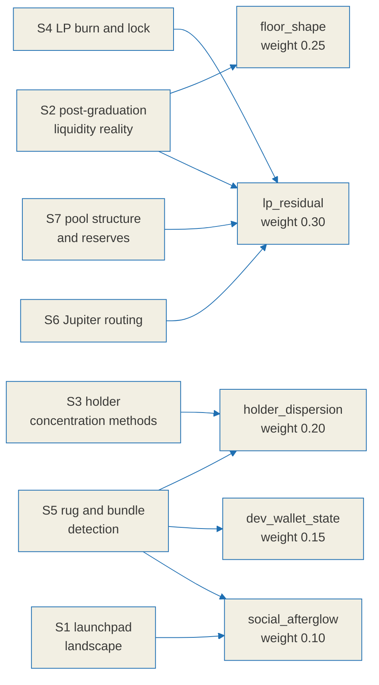

# Relic score research notes

This is the evidence ledger behind [`./relic-spec.md`](./relic-spec.md) and the
label rules it implements. Its purpose is to show that every formula, weight and
threshold in the specification rests on something observed rather than on
intuition, and to be equally explicit about the places where the evidence runs
out.

On-chain figures are time dependent, so the specification does not hard-code any
of the numbers below. It observes them at runtime and records what it saw.

## Confidence labels

Every claim in this document carries one of three labels. They are used
consistently and they mean exactly this:

| Label | Meaning |
|---|---|
| `[verified]` | Confirmed against a primary source, which is linked inline. |
| `[estimate]` | Supported by evidence, but no single figure can be pinned down. Ranges, or agreement across secondary sources without a primary one. |
| `[unverified]` | Investigated and **not** confirmed. The primary check failed or no free primary source exists. Section 8 lists all of these in one place. |

An `[unverified]` item is never promoted to a fact elsewhere in the
specification. Each one is absorbed either as an explicit unknown state or as a
reduction in the confidence attached to a label.

## Method and limits

- Primary sources were preferred: official documentation, papers on arXiv and
  SSRN, and API references. Secondary blog posts were used only for cross-checking.
- **Two arXiv PDFs could not be parsed.** For `2512.00377` (memecoin fragility,
  a 3.2MB body) the PDF streams were compressed and body figures could not be
  extracted. Only abstract-level framing was obtained, so anything that would
  have depended on that body text is labelled `[unverified]`.
- **No free canonical on-chain source of CEX wallet labels was found.** This is
  a known bias source for the holder dispersion axis and is handled explicitly
  in the specification rather than ignored.

## How the evidence reaches the score

---

## 1. Solana meme launchpad landscape, 2025 to 2026

### 1.1 pump.fun bonding curve graduation `[verified]`

- A bonding curve completes at roughly **85 SOL of real reserves**, on top of
  which **30 SOL of virtual reserves** bootstrap the price. That corresponds to
  roughly **$69,000** of market capitalisation, depending on the SOL price at
  the time. Sources: [pump.fun bonding curve docs](https://pump.fun/docs/bonding-curve),
  [arXiv 2607.02823](https://arxiv.org/html/2607.02823),
  [crypto.news](https://crypto.news/how-meme-coins-are-made-bonding-curves-pump-fun-rug-pulls/)
- **The destination changed, and that matters.** Tokens that graduated before
  2025-03 migrated to **Raydium**. After the launch of **PumpSwap**, pump.fun's
  own AMM, in 2025-03, they migrate to PumpSwap instead. Sources:
  [Bitquery pump-fun-to-pump-swap](https://docs.bitquery.io/docs/blockchain/Solana/Pumpfun/pump-fun-to-pump-swap/),
  [Smithii](https://smithii.io/en/graduate-token-pump-fun/)
- **LP tokens are burned at graduation**, so migrated liquidity cannot be pulled
  back out. This covers the migrated liquidity only, not liquidity added
  afterwards. Sources: Bitquery and Smithii above,
  [DeepWiki: pump.fun liquidity docs](https://deepwiki.com/pump-fun/pump-public-docs/4.4-liquidity-management)

### 1.2 Graduation rates `[verified + estimate]`

The figure depends entirely on the measurement window. **There is no single
true graduation rate**, so the specification does not use this number at all.
Graduation is decided per token from the on-chain migration itself.

| Window | Rate | Character | Source |
|---|---|---|---|
| 2026-05 to 06, 832,941 launches | 0.198% (95% CI 0.189 to 0.208) | **Lower bound**; the collector could only track graduations within 6 minutes | [arXiv 2607.02823](https://arxiv.org/html/2607.02823) |
| 2025-09 to 10, 655,770 sample | 0.63% | Prior work (Marino et al.) | [arXiv 2607.02823](https://arxiv.org/html/2607.02823), citing |
| 2025-04 | 0.37% to 1.78% | Daily variation | [bitcoinke](https://bitcoinke.io/2025/03/pump-fun-memecoins-survival-rate/) |
| Summer 2025 | 0.92% | | [MEXC](https://www.mexc.com/news/586607) |
| Separate tally | 1.4% graduate; 3% of users clear $1,000 or more in profit | | [Bitget](https://www.bitget.com/news/detail/12560604161427) |

- **Social presence raises the graduation rate substantially** `[verified]`:
  tokens advertised on Telegram graduated at 1.485% against 0.166% for
  unadvertised ones, about 8.94 times higher, with a Cox hazard ratio of 5.40.
  Advertising across all three channel types gave 1.919%. Source:
  [arXiv 2607.02823](https://arxiv.org/html/2607.02823)
  - **Implication**: social signal works as a measured proxy for attention,
    which is what justifies approximating the `social_afterglow` axis from
    on-chain behaviour.

### 1.3 Competing launchpad mechanics `[verified]`

- **LetsBonk** (late 2025-04, BONK community with Raydium): automatic graduation
  to **Raydium at $69k / 85 SOL with immediate LP burn**. Held 70 to 78% market
  share at one point in 2025-07. Sources:
  [drawpie](https://www.drawpie.com/en/post/solana-letsbonk-grabs-58-5-share-flywheel-raydium-liquidity-lock-deflationary-design),
  [Bitget academy](https://web3.bitget.com/en/academy/what-is-letsbonk-fun-complete-guide-to-the-top-solana-meme-coin-launchpad)
- **Believe** (2025): built around social integration. Share swung sharply, from
  13.6% on 2025-05-15 to 2.6% two days later. Source:
  [yellow.com launchpad wars](https://yellow.com/research/solana-launchpad-wars-2025-how-pumpfun-heavendex-and-letsbonk-are-revolutionizing-crypto-token-launches)
- **Moonshot**: 80% of supply for trading, 20% for the creator. Graduates at
  roughly $63k to $73k. Mobile on and off ramps including PayPal and card.
  Source: [Smithii Moonit](https://smithii.io/en/launch-token-on-moonit/)
- **Shared pattern** `[verified]`: nearly every meme launchpad follows
  "bonding curve, then a market-cap threshold, then migration to an AMM with the
  LP burned". **BAZR only covers the period after that migration, so it must be
  able to locate the pool whichever AMM it landed in, PumpSwap or Raydium.**

---

