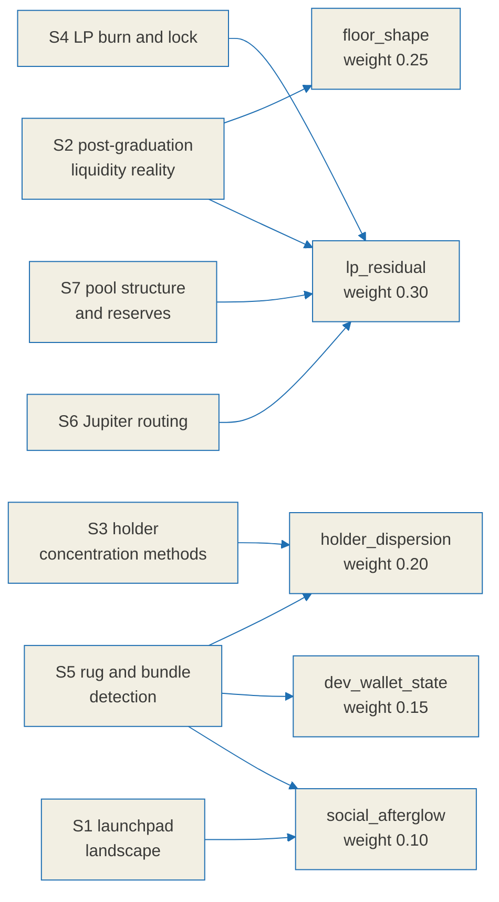

# Relic score research notes

This is the evidence ledger behind [`./relic-spec.md`](./relic-spec.md) and the
label rules it implements. Its purpose is to show that every formula, weight and
threshold in the specification rests on something observed rather than on
intuition, and to be equally explicit about the places where the evidence runs
out.

On-chain figures are time dependent, so the specification does not hard-code any
of the numbers below. It observes them at runtime and records what it saw.

## Confidence labels

Every claim in this document carries one of three labels. They are used
consistently and they mean exactly this:

| Label | Meaning |
|---|---|
| `[verified]` | Confirmed against a primary source, which is linked inline. |
| `[estimate]` | Supported by evidence, but no single figure can be pinned down. Ranges, or agreement across secondary sources without a primary one. |
| `[unverified]` | Investigated and **not** confirmed. The primary check failed or no free primary source exists. Section 8 lists all of these in one place. |

An `[unverified]` item is never promoted to a fact elsewhere in the
specification. Each one is absorbed either as an explicit unknown state or as a
reduction in the confidence attached to a label.

## Method and limits

- Primary sources were preferred: official documentation, papers on arXiv and
  SSRN, and API references. Secondary blog posts were used only for cross-checking.
- **Two arXiv PDFs could not be parsed.** For `2512.00377` (memecoin fragility,
  a 3.2MB body) the PDF streams were compressed and body figures could not be
  extracted. Only abstract-level framing was obtained, so anything that would
  have depended on that body text is labelled `[unverified]`.
- **No free canonical on-chain source of CEX wallet labels was found.** This is
  a known bias source for the holder dispersion axis and is handled explicitly
  in the specification rather than ignored.

## How the evidence reaches the score

---

## 1. Solana meme launchpad landscape, 2025 to 2026

### 1.1 pump.fun bonding curve graduation `[verified]`

- A bonding curve completes at roughly **85 SOL of real reserves**, on top of
  which **30 SOL of virtual reserves** bootstrap the price. That corresponds to
  roughly **$69,000** of market capitalisation, depending on the SOL price at
  the time. Sources: [pump.fun bonding curve docs](https://pump.fun/docs/bonding-curve),
  [arXiv 2607.02823](https://arxiv.org/html/2607.02823),
  [crypto.news](https://crypto.news/how-meme-coins-are-made-bonding-curves-pump-fun-rug-pulls/)
- **The destination changed, and that matters.** Tokens that graduated before
  2025-03 migrated to **Raydium**. After the launch of **PumpSwap**, pump.fun's
  own AMM, in 2025-03, they migrate to PumpSwap instead. Sources:
  [Bitquery pump-fun-to-pump-swap](https://docs.bitquery.io/docs/blockchain/Solana/Pumpfun/pump-fun-to-pump-swap/),
  [Smithii](https://smithii.io/en/graduate-token-pump-fun/)
- **LP tokens are burned at graduation**, so migrated liquidity cannot be pulled
  back out. This covers the migrated liquidity only, not liquidity added
  afterwards. Sources: Bitquery and Smithii above,
  [DeepWiki: pump.fun liquidity docs](https://deepwiki.com/pump-fun/pump-public-docs/4.4-liquidity-management)

### 1.2 Graduation rates `[verified + estimate]`

The figure depends entirely on the measurement window. **There is no single
true graduation rate**, so the specification does not use this number at all.
Graduation is decided per token from the on-chain migration itself.

| Window | Rate | Character | Source |
|---|---|---|---|
| 2026-05 to 06, 832,941 launches | 0.198% (95% CI 0.189 to 0.208) | **Lower bound**; the collector could only track graduations within 6 minutes | [arXiv 2607.02823](https://arxiv.org/html/2607.02823) |
| 2025-09 to 10, 655,770 sample | 0.63% | Prior work (Marino et al.) | [arXiv 2607.02823](https://arxiv.org/html/2607.02823), citing |
| 2025-04 | 0.37% to 1.78% | Daily variation | [bitcoinke](https://bitcoinke.io/2025/03/pump-fun-memecoins-survival-rate/) |
| Summer 2025 | 0.92% | | [MEXC](https://www.mexc.com/news/586607) |
| Separate tally | 1.4% graduate; 3% of users clear $1,000 or more in profit | | [Bitget](https://www.bitget.com/news/detail/12560604161427) |

- **Social presence raises the graduation rate substantially** `[verified]`:
  tokens advertised on Telegram graduated at 1.485% against 0.166% for
  unadvertised ones, about 8.94 times higher, with a Cox hazard ratio of 5.40.
  Advertising across all three channel types gave 1.919%. Source:
  [arXiv 2607.02823](https://arxiv.org/html/2607.02823)
  - **Implication**: social signal works as a measured proxy for attention,
    which is what justifies approximating the `social_afterglow` axis from
    on-chain behaviour.

### 1.3 Competing launchpad mechanics `[verified]`

- **LetsBonk** (late 2025-04, BONK community with Raydium): automatic graduation
  to **Raydium at $69k / 85 SOL with immediate LP burn**. Held 70 to 78% market
  share at one point in 2025-07. Sources:
  [drawpie](https://www.drawpie.com/en/post/solana-letsbonk-grabs-58-5-share-flywheel-raydium-liquidity-lock-deflationary-design),
  [Bitget academy](https://web3.bitget.com/en/academy/what-is-letsbonk-fun-complete-guide-to-the-top-solana-meme-coin-launchpad)
- **Believe** (2025): built around social integration. Share swung sharply, from
  13.6% on 2025-05-15 to 2.6% two days later. Source:
  [yellow.com launchpad wars](https://yellow.com/research/solana-launchpad-wars-2025-how-pumpfun-heavendex-and-letsbonk-are-revolutionizing-crypto-token-launches)
- **Moonshot**: 80% of supply for trading, 20% for the creator. Graduates at
  roughly $63k to $73k. Mobile on and off ramps including PayPal and card.
  Source: [Smithii Moonit](https://smithii.io/en/launch-token-on-moonit/)
- **Shared pattern** `[verified]`: nearly every meme launchpad follows
  "bonding curve, then a market-cap threshold, then migration to an AMM with the
  LP burned". **BAZR only covers the period after that migration, so it must be
  able to locate the pool whichever AMM it landed in, PumpSwap or Raydium.**

---

## 2. Post-graduation liquidity reality

### 2.1 The scale of the die-off: `[verified]` qualitatively, `[estimate]` quantitatively

- **The overwhelming majority of graduated tokens lose all trading activity
  within 48 hours.** A large share lose meaningful volume on their **first day**
  on PumpSwap. Sources:
  [JUMPBIT, 5 reasons tokens died](https://medium.com/@jump_bit/5-reasons-your-pump-fun-token-died-after-graduation-and-how-to-prevent-it-c04a3a1a8f9d),
  [JUMPBIT, 30-minute playbook](https://medium.com/@jump_bit/the-30-minute-post-graduation-playbook-keep-your-pump-fun-token-alive-on-pumpswap-59c71e08ebb6)
- **The working definition of "dead"** `[verified]`: if there is no activity, no
  liquidity depth and no sign of life within 15 to 30 minutes of graduation, the
  token is treated as dead in practice. Thin liquidity plus zero volume plus a
  flat chart on a screener drives traders away permanently. Sources: JUMPBIT
  above, [TradingView / Cointelegraph](https://tr.tradingview.com/news/cointelegraph%3A56f07a8fa094b%3A0-pump-fun-memecoins-are-dying-at-record-rates-less-than-1-survive)
- **`[unverified]`**: the precise percentage still trading N days after
  graduation. The qualitative claim, that most die within 24 to 48 hours, is
  consistent across multiple sources, but **no quantitative survival curve was
  confirmed from a primary statistic**. The failed extraction of the
  `2512.00377` memecoin fragility PDF is the direct cause of this gap.
  Consequence: the specification hard-codes no such percentage and instead
  decides per token from measured trading continuity (`floor_shape`).

### 2.2 What a dead pair looks like `[verified]`

- Absent depth leads to no buyers, which leads to a flat chart, which leads to
  no new attention. The loop closes on itself. Sources: both JUMPBIT articles above.
- **Implication**: death shows up as **depth collapse plus the disappearance of
  trades**, not as a falling price. That is why `lp_residual` (real depth on the
  quote side) and `floor_shape` (trading continuity) carry the two largest
  weights. Price is deliberately excluded from the axes, because a price series
  invites exactly the forecasting reading this project refuses to make.

---

## 3. Holder concentration

### 3.1 Metrics in common use `[verified]`

- **Top-N share**, especially top-10. A top-10 holding 30 to 50% or more of
  supply is treated as a manipulation and dump risk; "top-10 above 30% is not
  recommended" is the common phrasing, and a single wallet above 35% forces a
  risk grade. Sources:
  [Veritas Protocol](https://www.veritasprotocol.com/blog/token-holder-concentration-analysis-metrics-and-limits),
  [BarryGuard](https://www.barryguard.com/blog/how-to-check-solana-token-rug-pull)
- **HHI** (Herfindahl-Hirschman): the sum of squared shares, on a 0 to 10,000
  scale, higher meaning more concentrated. Sources:
  [CCN on HHI](https://www.ccn.com/education/crypto/hhi-index-crypto-market-analysis/),
  [Bitquery on wealth distribution](https://bitquery.io/blog/wealth-distribution-in-token-economy)
- **Gini** (0 to 1) for inequality, and **Nakamoto coefficient**, the smallest
  number of wallets that together hold more than 51% of supply. Source:
  [Bitquery](https://bitquery.io/blog/wealth-distribution-in-token-economy)
- Scanners in the Rugcheck family combine mint and freeze authority, LP burn,
  sniper and bundler detection, and top-holder concentration in one view.
  Source: [Solana Tracker Rugcheck](https://www.solanatracker.io/rugcheck)

### 3.2 The trap: counting CEX, LP and bundle wallets as holders `[verified, central]`

- **Holder HHI that does not exclude protocol-controlled addresses (staking
  contracts, treasuries, bridge custody, exchange wallets) overstates
  concentration by a median factor of 2.3 and by up to 18 times.** Source:
  [Frontiers in Blockchain, empirical study of 52 protocols](https://www.frontiersin.org/journals/blockchain/articles/10.3389/fbloc.2026.1853465/full)
- Gini and Nakamoto calculations **cannot automatically separate smart contract
  and exchange addresses from individuals**, so without filtering they overstate
  centralisation. Source: [Bitquery](https://bitquery.io/blog/wealth-distribution-in-token-economy)
- **Implication, applied directly in the specification**: `holder_dispersion` is
  computed over an **effective float** that excludes (a) AMM pool vaults,
  (b) known CEX wallets, (c) burn addresses, and (d) identified bundle or
  insider clusters. Without those exclusions the LP vault, which holds a large
  share of supply, ranks as the top holder and a perfectly ordinary token is
  misread as extremely concentrated.
- **`[unverified]`**: a free canonical source of CEX wallet labels. CEX labels
  are therefore treated as an external or manually curated list, and the upward
  bias that remains when the list is incomplete is stated in the specification.
  In the segment BAZR covers, graduated meme tokens that have died, CEX listings
  are effectively absent, so the practical impact of this gap is small
  (`[estimate]`).

### 3.3 Reading holders: Helius getTokenAccounts `[verified]`

- `getTokenAccounts` (DAS) returns every token account for a mint. Response
  fields: `{address, mint, owner, amount, delegated_amount, frozen, burnt}`.
  **Maximum 1,000 per page**, paginated by `page` or `cursor`. Holders are
  counted by de-duplicating `owner`, since one wallet can hold several accounts
  for the same mint. Sources:
  [Helius on token holders](https://www.helius.dev/blog/how-to-get-token-holders-on-solana),
  [Helius getTokenAccounts reference](https://www.helius.dev/docs/api-reference/das/gettokenaccounts)
- **Caveat** `[verified]`: the Helius documentation describes **no logic for
  excluding LP, pool or program-owned accounts**. The exclusions in section 3.2
  have to be implemented on our side.

---

