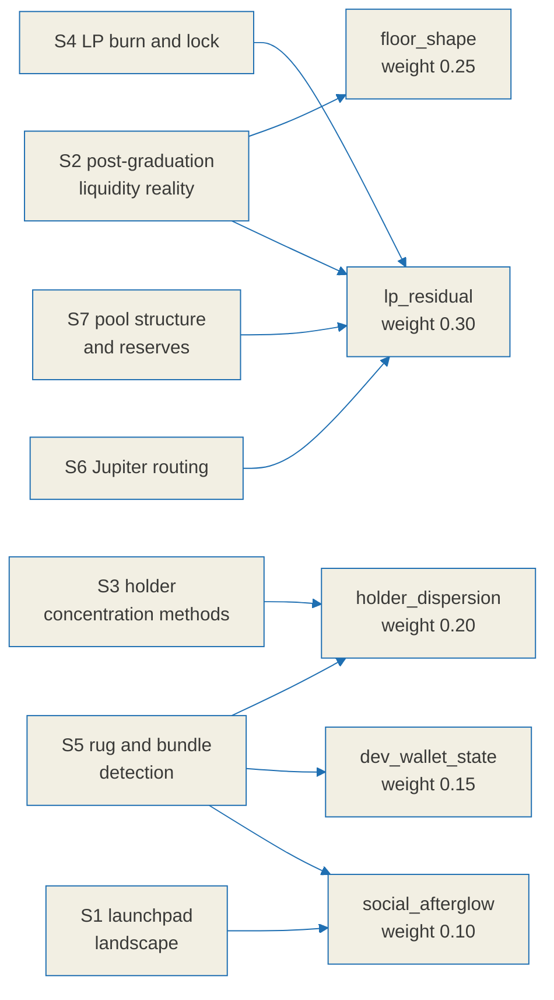

# Relic score research notes

This is the evidence ledger behind [`./relic-spec.md`](./relic-spec.md) and the
label rules it implements. Its purpose is to show that every formula, weight and
threshold in the specification rests on something observed rather than on
intuition, and to be equally explicit about the places where the evidence runs
out.

On-chain figures are time dependent, so the specification does not hard-code any
of the numbers below. It observes them at runtime and records what it saw.

## Confidence labels

Every claim in this document carries one of three labels. They are used
consistently and they mean exactly this:

| Label | Meaning |
|---|---|
| `[verified]` | Confirmed against a primary source, which is linked inline. |
| `[estimate]` | Supported by evidence, but no single figure can be pinned down. Ranges, or agreement across secondary sources without a primary one. |
| `[unverified]` | Investigated and **not** confirmed. The primary check failed or no free primary source exists. Section 8 lists all of these in one place. |

An `[unverified]` item is never promoted to a fact elsewhere in the
specification. Each one is absorbed either as an explicit unknown state or as a
reduction in the confidence attached to a label.

## Method and limits

- Primary sources were preferred: official documentation, papers on arXiv and
  SSRN, and API references. Secondary blog posts were used only for cross-checking.
- **Two arXiv PDFs could not be parsed.** For `2512.00377` (memecoin fragility,
  a 3.2MB body) the PDF streams were compressed and body figures could not be
  extracted. Only abstract-level framing was obtained, so anything that would
  have depended on that body text is labelled `[unverified]`.
- **No free canonical on-chain source of CEX wallet labels was found.** This is
  a known bias source for the holder dispersion axis and is handled explicitly
  in the specification rather than ignored.

## How the evidence reaches the score

---

