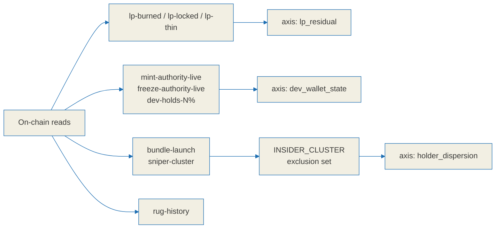

# Tag label specification

Tags are short, evidence-backed statements about what was observed on-chain for a token.
They sit next to the relic score defined in [`./relic-spec.md`](./relic-spec.md) and travel
in the `Tag` shape defined in [`./api-contract.md`](./api-contract.md).

**Tags report observations. They do not accuse anyone and they do not predict anything.**
A tag says what a set of accounts and transactions looked like at a point in time. It never
claims intent, never claims a future action, and never carries a recommendation to trade.

**Tags are shown, not hidden.** A token whose creator still holds a large share, or whose
launch shows coordinated buying, gets that stated plainly on its listing. Suppressing
unflattering labels would make the clean ones meaningless.

Because the labels are displayed rather than buried, **wording is a responsibility**.
Confirmed on-chain facts may be stated flatly. Heuristic determinations must be phrased as
observations and must expose their false-positive risk through the `confidence` field.

---

## 0. Common rules

### 0.1 Wire format

```jsonc
{
  "key": "lp-burned",
  "label": "LP burned",        // English, rendered directly on the listing
  "severity": "info",          // "info" | "caution" | "alert"
  "observed": true,            // whether the observation actually holds
  "confidence": "high",        // "high" | "medium" | "low"
  "evidence": { }              // signatures, accounts, numbers. The UI expands this.
}
```

### 0.2 Assertion versus observation

| `confidence` | Nature | Required tone | Example |
| --- | --- | --- | --- |
| `high` | Confirmed on-chain fact, read from an account field or a supply computation | May be stated flatly | `Mint authority is live` |
| `medium` | Heuristic with a strong corroborating signal | Observational phrasing | `Bundled buys observed at launch` |
| `low` | Attribution is uncertain, or the underlying definition is subjective | Observational phrasing **and** linked evidence | `Creator linked to N tokens that went to ~0 liquidity` |

- **Prohibited in `low` and `medium` labels:** accusatory nouns such as `scam` or `rugger`,
  any word asserting certainty, and any future or probability claim. The label reports an
  observation; it does not convict.
- `evidence` is always populated so the interface can answer "why does this token carry
  this label". **A label with no evidence is not emitted.**
- `severity` is the **size of the risk**. `confidence` is the **certainty of the
  determination**. They are independent. `rug-history` can legitimately be
  `severity: alert` with `confidence: low`, meaning "potentially serious, not established".

### 0.3 Relationship to the score axes

- `lp-burned`, `lp-locked` and `lp-thin` expose the `classify_lp` and `quote_usd`
  observations behind the `lp_residual` axis. Same observation, different surface.
- `mint-authority-live`, `freeze-authority-live` and `dev-holds-N%` are the label form of
  the `dev_wallet_state` observations.
- The wallet sets identified by `bundle-launch` and `sniper-cluster` feed
  `INSIDER_CLUSTER` in [`./relic-spec.md`](./relic-spec.md) section 1.1, where they become
  part of the exclusion set for `holder_dispersion`. **This means a false positive here
  propagates into the score**, which is why both labels require corroboration before they
  reach `medium` confidence.



---

## 1. `mint-authority-live`

- **Observed fact:** the mint account has `mintAuthority != null`. Further issuance is
  possible.
- **Threshold:** true when the `mintAuthority` field is not null. Binary, nothing to compute.
- **severity:** `alert` - **confidence:** `high` - **observed:** true when the authority exists
- **False-positive risk:** effectively none; this is a confirmed on-chain field. There are
  legitimate uses, however: some Token-2022, staking and rebasing designs keep the mint
  authority intentionally. In this domain a live mint authority is a risk, but the label
  describes a **capability** ("supply can still be inflated"), never a prediction that it
  will be used.
- **Display copy:** `Mint authority is live - supply can still be inflated.`
- **evidence:** `{ mint_authority: "<pubkey>", checked_slot }`

