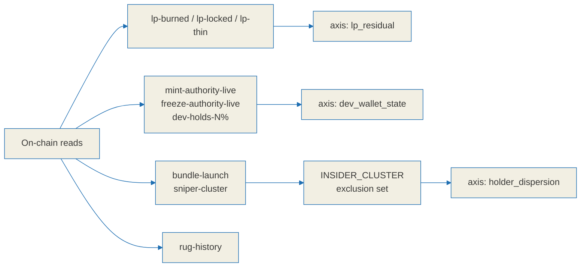

# Tag label specification

Tags are short, evidence-backed statements about what was observed on-chain for a token.
They sit next to the relic score defined in [`./relic-spec.md`](./relic-spec.md) and travel
in the `Tag` shape defined in [`./api-contract.md`](./api-contract.md).

**Tags report observations. They do not accuse anyone and they do not predict anything.**
A tag says what a set of accounts and transactions looked like at a point in time. It never
claims intent, never claims a future action, and never carries a recommendation to trade.

**Tags are shown, not hidden.** A token whose creator still holds a large share, or whose
launch shows coordinated buying, gets that stated plainly on its listing. Suppressing
unflattering labels would make the clean ones meaningless.

Because the labels are displayed rather than buried, **wording is a responsibility**.
Confirmed on-chain facts may be stated flatly. Heuristic determinations must be phrased as
observations and must expose their false-positive risk through the `confidence` field.

---

## 0. Common rules

### 0.1 Wire format

```jsonc
{
  "key": "lp-burned",
  "label": "LP burned",        // English, rendered directly on the listing
  "severity": "info",          // "info" | "caution" | "alert"
  "observed": true,            // whether the observation actually holds
  "confidence": "high",        // "high" | "medium" | "low"
  "evidence": { }              // signatures, accounts, numbers. The UI expands this.
}
```

### 0.2 Assertion versus observation

| `confidence` | Nature | Required tone | Example |
| --- | --- | --- | --- |
| `high` | Confirmed on-chain fact, read from an account field or a supply computation | May be stated flatly | `Mint authority is live` |
| `medium` | Heuristic with a strong corroborating signal | Observational phrasing | `Bundled buys observed at launch` |
| `low` | Attribution is uncertain, or the underlying definition is subjective | Observational phrasing **and** linked evidence | `Creator linked to N tokens that went to ~0 liquidity` |

- **Prohibited in `low` and `medium` labels:** accusatory nouns such as `scam` or `rugger`,
  any word asserting certainty, and any future or probability claim. The label reports an
  observation; it does not convict.
- `evidence` is always populated so the interface can answer "why does this token carry
  this label". **A label with no evidence is not emitted.**
- `severity` is the **size of the risk**. `confidence` is the **certainty of the
  determination**. They are independent. `rug-history` can legitimately be
  `severity: alert` with `confidence: low`, meaning "potentially serious, not established".

### 0.3 Relationship to the score axes

- `lp-burned`, `lp-locked` and `lp-thin` expose the `classify_lp` and `quote_usd`
  observations behind the `lp_residual` axis. Same observation, different surface.
- `mint-authority-live`, `freeze-authority-live` and `dev-holds-N%` are the label form of
  the `dev_wallet_state` observations.
- The wallet sets identified by `bundle-launch` and `sniper-cluster` feed
  `INSIDER_CLUSTER` in [`./relic-spec.md`](./relic-spec.md) section 1.1, where they become
  part of the exclusion set for `holder_dispersion`. **This means a false positive here
  propagates into the score**, which is why both labels require corroboration before they
  reach `medium` confidence.



---

## 1. `mint-authority-live`

- **Observed fact:** the mint account has `mintAuthority != null`. Further issuance is
  possible.
- **Threshold:** true when the `mintAuthority` field is not null. Binary, nothing to compute.
- **severity:** `alert` - **confidence:** `high` - **observed:** true when the authority exists
- **False-positive risk:** effectively none; this is a confirmed on-chain field. There are
  legitimate uses, however: some Token-2022, staking and rebasing designs keep the mint
  authority intentionally. In this domain a live mint authority is a risk, but the label
  describes a **capability** ("supply can still be inflated"), never a prediction that it
  will be used.
- **Display copy:** `Mint authority is live - supply can still be inflated.`
- **evidence:** `{ mint_authority: "<pubkey>", checked_slot }`

## 2. `freeze-authority-live`

- **Observed fact:** the mint account has `freezeAuthority != null`. Token accounts can be
  frozen, which blocks their holders from selling.
- **Threshold:** true when `freezeAuthority != null`.
- **severity:** `alert` - **confidence:** `high` - **observed:** true when the authority exists
- **False-positive risk:** effectively none. Important caveat: pump.fun revokes the mint
  authority by default but **does not always revoke freeze**, so "it is a pump token,
  therefore freeze is revoked" is an invalid assumption. Read the field per token. Some
  regulated-asset designs use freeze legitimately; in a meme aftermarket it is a
  sell-blocking vector.
- **Display copy:** `Freeze authority is live - holders can be blocked from selling.`
- **evidence:** `{ freeze_authority: "<pubkey>", checked_slot }`

## 3. `lp-burned`

- **Observed fact:** the pool's LP tokens have been burned, so the migrated liquidity
  cannot be pulled back out.
- **Threshold:** `burn_pct >= 99`, where
  `burn_pct = ((max(supply, lpReserve-1) - supply) / max(supply, lpReserve-1)) * 100`,
  **or** a confirmed PumpSwap migration burn (`lp_supply` plus the migration record).
- **severity:** `info` - **confidence:** `high` when confirmed via the migration record,
  `medium` when derived only from the Raydium-style burn computation
- **False-positive risk:**
  - Token-2022 LP (PumpSwap) has different burn semantics from classic SPL. **Not
    branching by path produces wrong determinations.** PumpSwap uses `lp_mint` circulation
    and `lp_supply`; Raydium uses the supply/reserve formula above.
  - When liquidity sits in **several pools**, labelling the token "burned" from one pool
    misses pullable LP in another. The label is therefore attached **per pool**, and a
    token-level summary distinguishes "some pools burned".
  - Partial burns must not be rounded up to complete ones. `burn_pct` is exposed verbatim
    in the evidence.
- **Display copy:** `LP burned (pool liquidity locked permanently).` For a partial burn:
  `LP mostly burned (NN%).`
- **evidence:** `{ per_pool: [{ amm, lp_mint, burn_pct, method: "migrate" | "supply-calc" }] }`

## 4. `lp-locked`

- **Observed fact:** LP tokens are held by a known locker contract and the unlock time is
  in the future.
- **Threshold:** the LP holder is an account owned by a **known locker program** **and**
  `unlock_time > now`.
- **severity:** `info` - **confidence:** `high` when the contract and expiry are both
  confirmed, `medium` when the locker is identified but the expiry cannot be parsed
- **False-positive risk:**
  - **An unknown locker program yields a false negative** - the LP is locked but not
    detected. Therefore the absence of `lp-locked` must never be presented as "pullable".
    When no locker is identified, `lp_residual` conservatively treats that LP as
    `unlocked`, which biases the score down rather than overstating safety.
  - **An expired lock is not a lock.** Once `unlock_time <= now` the label is removed and
    the pullable-liquidity assessment is recomputed.
  - Locking is weaker than burning: the liquidity becomes withdrawable again at expiry.
    The interface must always show the unlock date alongside the label.
- **Display copy:** `LP locked until <date> via <locker>.`
- **evidence:** `{ locker, lock_account, unlock_time, amount, share_of_lp }`

## 5. `lp-thin`

- **Observed fact:** summed quote-side liquidity across all discovered pools is small, so
  exiting a position is constrained.
- **Threshold:** `quote_usd` (summed over all pools) `< $1,000`. Note the deliberate offset
  from the score: [`./relic-spec.md`](./relic-spec.md) section 3 puts the depth-score floor
  at `$300`, while this label warns at the more generous `$1,000` so a user sees thinness
  before it becomes total.
- **severity:** `caution` - **confidence:** `high` given a fresh multi-pool read
- **False-positive risk:**
  - **Not summing across pools produces a false "thin"** when liquidity simply sits in
    another pool. Every discovered pool must be included.
  - **Stale reserve reads** misjudge a moment. Read at one slot and record
    `last_indexed_slot`.
  - If the SOL price needed for USD conversion cannot be observed, the label is withheld as
    unknown. It is never computed as `$0`.
- **Display copy:** `Thin liquidity - about $<amount> of exit depth across <k> pool(s).`
- **evidence:** `{ quote_usd, pools: [{ amm, quote_usd }], sol_price_used, checked_slot }`

## 6. `dev-holds-N%`

- **Observed fact:** the identified creator wallet or wallets currently hold N% of supply.
- **Threshold:** shown from `dev_pct >= 5%`. N is exposed as the observed value, rounded to
  1%. At `>= 20%` the severity is raised.
- **severity:** `caution` for 5-20%, `alert` for `>= 20%` - **confidence:** `medium`,
  because creator attribution is heuristic
- **False-positive risk:**
  - **Creator misattribution.** The creation-tx signer, the first funder and the
    `coin_creator` field can all point at someone other than the actual developer, through
    proxy deployment or paid-for creation. The label therefore uses observational phrasing
    and records the attribution basis in the evidence.
  - If the wallet is in fact an LP or staking contract, the holding is overstated. Cross
    check against the `EXCLUDE` set from the score specification.
  - N% is a **fact, not an intent**. The copy states the holding and nothing about what the
    holder will do with it.
- **Display copy:** `Creator wallet holds ~N% of supply.`
- **evidence:** `{ creator, attribution: "signer" | "first-funder" | "coin_creator", dev_pct, wallets: [...] }`

## 7. `bundle-launch`

- **Observed fact:** at launch, multiple wallets bought in a coordinated way (same slot, or
  a shared funding source) and together took a substantial share of supply.
- **Threshold:** `K >= 5` wallets buying at or immediately adjacent to the launch slot
  **and** a combined acquired supply of `>= 15%`. A Solana slot is roughly 400ms, so
  distinct wallets filling in the same slot is a coordination signal. Secondary
  corroboration: a **shared funding source** shortly before launch, or **fresh wallets**
  with no prior history.
- **severity:** `caution` - **confidence:** `medium`
- **False-positive risk:**
  - **Ordinary snipers and MEV bots also land in the same slot.** They cannot be separated
    from insiders with certainty, which is exactly why the copy says "bundled buys
    observed" and never uses an accusatory noun.
  - Same-slot coincidence is possible, if unlikely. The shared-funder and fresh-wallet
    corroboration is carried in the evidence so a reader can judge it.
  - **Presentation is numeric**: bundled supply X%, K wallets, currently holding Y%.
- **Display copy:** `Bundled buys observed at launch - K wallets took ~X% (now hold ~Y%).`
- **evidence:** `{ launch_slot, wallets: [...], bundled_pct, current_hold_pct, shared_funder, fresh_wallets }`

## 8. `sniper-cluster`

- **Observed fact:** within the first slots after launch, a cluster of wallets bought and
  those wallets link back to a shared funding source.
- **Threshold:** among wallets buying within the **first N = 5 slots** after launch, a
  cluster of size `>= 4` connected by a shared funder. Where `bundle-launch` is
  "simultaneous with launch", this is "coordinated entry immediately after".
- **severity:** `caution` - **confidence:** `medium` when the funding link is confirmed,
  `low` when only the timing is close
- **False-positive risk:**
  - **Independent sniper bots** can cluster by coincidence. Without a funding-graph link
    the confidence stays `low`.
  - If the shared funder is a **common service** such as an exchange withdrawal address or
    a bundler tip wallet, unrelated wallets get grouped together. Known shared services are
    excluded from clustering.
- **Display copy:** `Sniper cluster observed - M wallets entered within N slots from a shared funder.`
- **evidence:** `{ cluster_size, first_slots, shared_funder, wallets: [...] }`

